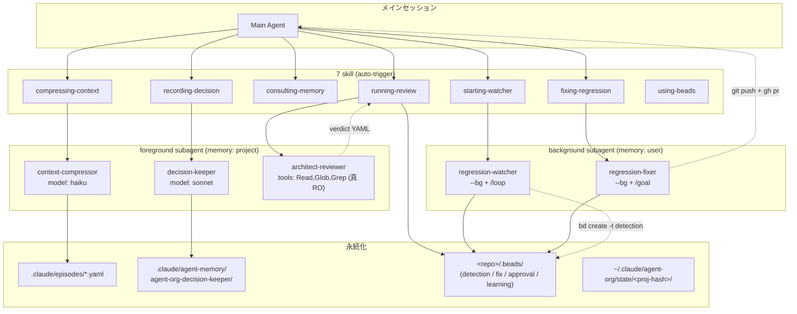

# agent-org Architecture

agent-org plugin の内部設計。v1.0.0 時点の統合アーキテクチャ。

## 設計原則

- **会話だけで動く**: skill の auto-trigger で全ワークフローが起動。明示 command は init/diagnostic/migration のみ
- **scoped name dir**: subagent memory は `agent-org-<agent-name>/` に解決 (`:` → `-`)。auto-inject で MEMORY.md が自動注入される (ADR-003)
- **beads hard dependency**: detection/fix/approval/learning は全て `<repo>/.beads/` に repo-local 配置 (ADR-007)
- **worktree 隔離回避**: `--bg` subagent は `memory: user` + git remote 経由で main session と通信

## 全体構成



## データフロー

### A. Episode 化 (自動)

1. `/compact` 実行 → PostCompact hook 発火
2. `postcompact-episode.sh` が `compact_summary` を episode YAML に変換
3. `.claude/episodes/compact-<timestamp>.yaml` に保存

### B. Episode 化 (手動)

1. ユーザーが会話で依頼 → `compressing-context` skill auto-trigger
2. context-compressor subagent が episode YAML 生成
3. `.claude/episodes/<id>.yaml` に保存

### C. ADR 記録

1. 設計判断確定 → `recording-decision` skill auto-trigger
2. decision-keeper subagent が ADR YAML 生成
3. `.claude/agent-memory/agent-org-decision-keeper/MEMORY.md` に追記
4. `bd remember "decision-meta: ..."` で cross-session 永続化

### D. Multi-perspective Review

1. レビュー依頼 → `running-review` skill auto-trigger
2. architect-reviewer を 3-5 perspective で並列 spawn (agent teams / Task tool fallback)
3. verdict YAML 集約 → bd approval issue 作成 + dep 連携
4. `bd remember "review-heuristic: ..."` で learning 永続化

### E. Regression 監視

1. 監視依頼 → `starting-watcher` skill auto-trigger
2. preflight → `claude --agent agent-org:regression-watcher --bg "/loop <interval> smoke check"`
3. 各 iteration で `bd create -t detection` + 直接 `bd remember` (handler 不在のため)

### F. Regression 修正

1. 修正依頼 → `fixing-regression` skill auto-trigger
2. preflight → `claude --agent agent-org:regression-fixer --bg "/goal <condition> or stop after N turns"`
3. 完了時: git push + gh pr + fix issue close
4. main session が `bd remember "fix-pattern: ..."` で learning 回収

## Cross-session Learning (ADR-010)

`bd remember` / `bd recall` / `bd memories` で 4 subagent の学習を
`<repo>/.beads/` の memory table に蓄積。`bd prime` の default 挙動で
次セッションに auto-inject。

| subagent | key prefix | writer |
|---|---|---|
| architect-reviewer | `review-heuristic-` | running-review skill (handler) |
| regression-fixer | `fix-pattern-` | fixing-regression skill (handler) |
| regression-watcher | `watch-heuristic-` / `false-positive-` | subagent prompt 内 Bash 直接 invoke |
| decision-keeper | `decision-meta-` | recording-decision skill (handler) |

slug は kebab-case 固定。`scripts/lint-bd-keys.sh` で機械検証可能。

## Worktree 隔離と対策

`--bg` session は working directory への書込が `.claude/worktrees/<id>/` に
自動隔離される。agent-org は以下で回避:

| 用途 | 対策 |
|---|---|
| subagent memory | `memory: user` (`~/.claude/agent-memory/...`、working dir 外) |
| detection/fix/learning | `<repo>/.beads/` (bd が worktree-aware で main repo を自動解決) |
| 修正成果の統合 | `git push` + `gh pr` (remote 操作は隔離されない) |
| commit 通知 | post-commit-trigger.sh が `~/.claude/agent-org/state/<proj-hash>/last-commit.json` を更新 |

### cross-project 混入対策

`memory: user` subagent は MEMORY.md 内で `## Project: <proj-hash>` セクション
に分離して記載。他プロジェクトのセクションは編集しない。

### /goal 暴走ガード

condition 末尾に `or stop after N turns` 句を強制。default turn-cap:
small=25 / medium=50 / large=80。上限 100。fixer 自身も cap の 90% で停止する
保守動作を prompt に含む。

## ファイルパス規約

| 用途 | パス | 書く側 |
|---|---|---|
| Episode YAML | `.claude/episodes/<id>.yaml` | postcompact-episode.sh / context-compressor |
| decision-keeper memory | `.claude/agent-memory/agent-org-decision-keeper/MEMORY.md` | decision-keeper |
| architect-reviewer memory | `.claude/agent-memory/agent-org-architect-reviewer/` | architect-reviewer |
| context-compressor memory | `.claude/agent-memory/agent-org-context-compressor/MEMORY.md` | context-compressor |
| watcher memory | `~/.claude/agent-memory/agent-org-regression-watcher/MEMORY.md` | watcher |
| fixer memory | `~/.claude/agent-memory/agent-org-regression-fixer/MEMORY.md` | fixer |
| beads DB | `<repo>/.beads/` | bd CLI (detection/fix/approval/learning) |
| last-commit pointer | `~/.claude/agent-org/state/<proj-hash>/last-commit.json` | post-commit-trigger.sh |
| detection state | `~/.claude/agent-org/state/<proj-hash>/detections/` | watcher |
| fix state | `~/.claude/agent-org/state/<proj-hash>/fixes/` | fixer |
| per-agent learnings | `~/.claude/agent-org/state/<proj-hash>/learnings/` | watcher / fixer |
| quality gate config | `.claude/agent-org/quality-gates.json` | ユーザー (手動配置) |

`<proj-hash>`: cwd を canonicalize → sha256 → 先頭 8 桁。

## Schema Reference

### Episode YAML

```yaml
episode:
  id: <ISO timestamp or descriptive slug>
  trigger: manual | auto | post_compact
  topic: <主題>
  decisions:
    - <決定>
  artifacts_changed:
    - path: <ファイル>
      summary: <変更要約>
  unresolved:
    - <持ち越し>
  retrieval_keys: [<キーワード>]
  source_summary: |
    <compact_summary or 手動圧縮本文>
```

### approval bd issue (v0.7.0+)

| 項目 | 表現 |
|---|---|
| type | `approval` |
| priority | `0`=rejected / `1`=conditional / `2`=approved / `3`=informational |
| 必須 label | `approval` / `task:<task_id>` / `agent-org` / `aggregate:<verdict>` |
| description body | 集約 verdict YAML |
| dep | `bd dep add <task> <approval>` |

verdict YAML:

```yaml
schema_version: "1"
task_id: PR-42
target:
  type: pr | commit_range | design_doc | implementation
  ref: PR#42
aggregate_overall: approve | approve_with_conditions | request_changes | reject
concerns_summary:
  critical: 0
  major: 1
  minor: 3
verdicts:
  - perspective: security
    overall: approve
    confidence: high
    concerns: [...]
```

### quality-gates.json

```json
{
  "schema_version": "1",
  "gates": [
    { "id": "tests-passing", "kind": "command", "command": "pytest -q", "required": true },
    { "id": "no-rejected-approvals", "kind": "approvals_clean", "required": true }
  ]
}
```

`kind`: `"command"` (shell exit code 0) / `"approvals_clean"` (bd rejected=0)。

### detection YAML

```yaml
detection:
  id: detection-<ISO ts>
  detected_at: <ISO-8601 UTC>
  project_hash: <proj-hash>
  trigger:
    type: scheduled_loop | post_commit | manual
  observation:
    kind: test_failure | build_failure | lint_regression | runtime_error
    severity: critical | major | minor
    summary: <1 行>
  evidence:
    - command: <bash>
      exit_code: <int>
      stdout_excerpt: |
        <抜粋>
  status: pending_fix
```

### fix state JSON

```json
{
  "schema_version": "1",
  "fix_id": "fix-<ISO ts>",
  "goal_status": "achieved | turn_limit | error",
  "pr_url": "https://github.com/<owner>/<repo>/pull/<n>",
  "commits": ["<sha>"],
  "turns_used": 25
}
```

### last-commit.json

```json
{
  "schema_version": "1",
  "commit_sha": "<HEAD sha>",
  "branch": "<branch>",
  "committed_at": "<ISO-8601 UTC>",
  "project_hash": "<proj-hash>"
}
```

## 未実装の領域 (v1.x で実害発生時に追加)

- テレメトリ (watcher/fixer の run 回数・成功率)
- 複数 fixer 並列起動
- auto-prune / TTL (bd memories 肥大化時)
- `--global` cross-project shared store
- missing learning lint (curate 漏れ検出)
