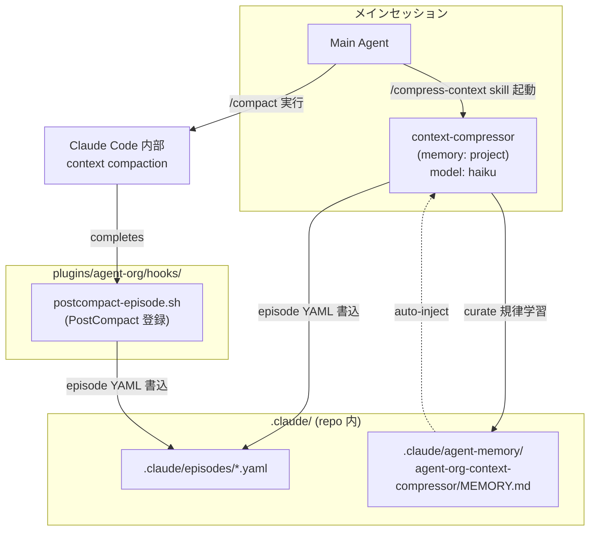
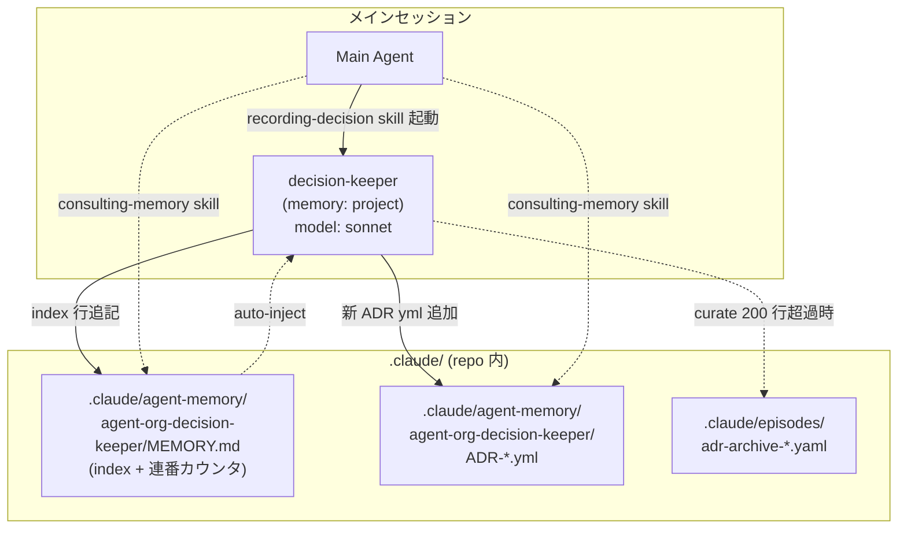
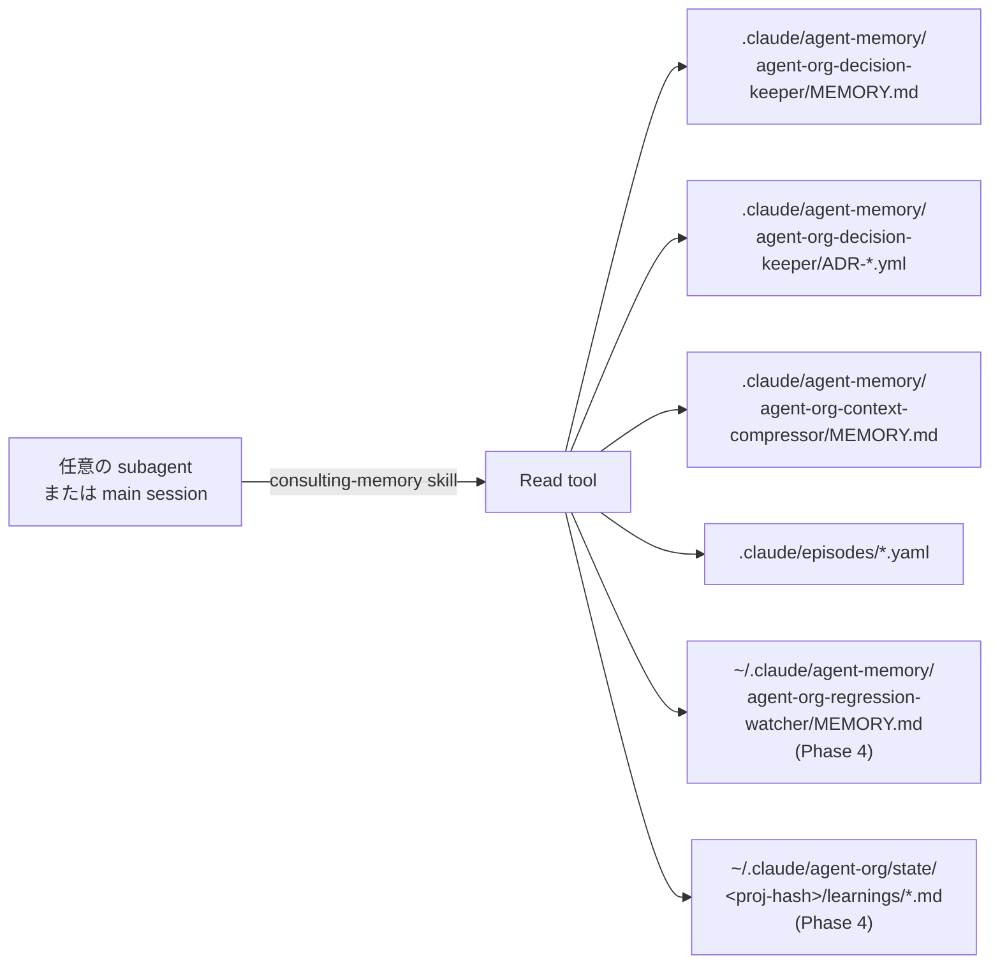

# agent-org Architecture

agent-org plugin の内部設計。Phase 1 + 2 範囲のみ記述。Phase 3 以降の設計は
親プラン (`~/.claude/plans/worktools-agent-org-plugin-cooperative-lamport.md`)
参照。

## 命名規則: scoped name dir (v0.3.0〜)

Claude Code v2.1.33+ は plugin subagent の memory dir を **scoped name** で
解決する (`<plugin-name>:<agent-name>` の `:` を `-` に置換した命名)。
agent-org plugin のすべての subagent は scoped name dir
(`agent-org-<agent-name>/`) を使う (ADR-003 採用判断、v0.3.0)。

これにより:

- subagent 起動時に MEMORY.md 先頭 200 行/25 KB が自動注入される
- フレームワーク命名と subagent 書込先が一致する
- 明示的な Read による情報注入が不要 (curate された MEMORY.md が常に subagent に届く)

## Phase 1 のコンポーネント関係



## データフロー

### A. PostCompact hook 経由 (自動)

1. ユーザーが `/compact` を実行、または auto-compact が走る
2. compaction 完了後、Claude Code が PostCompact hook を発火
3. hook 入力 JSON に `compact_summary` (string) と `trigger` (manual/auto) が含まれる
4. `hooks/postcompact-episode.sh` が:
   - `compact_summary` を優先抽出 (非空ならそれを使用)
   - 空・欠落時は `transcript_path` を JSONL parse して compact イベントを探す fallback
   - `.claude/episodes/compact-<ISO timestamp>.yaml` に YAML 形式で保存

### B. 手動圧縮 (`/compress-context`)

1. ユーザーが `/compress-context` を実行
2. compress-context command が `compressing-context` skill を起動
3. skill が context-compressor subagent を Task tool で invoke
   (`subagent_type: "agent-org:context-compressor"`)
4. context-compressor は起動時に
   `.claude/agent-memory/agent-org-context-compressor/MEMORY.md` の先頭
   200 行/25 KB が auto-inject され、過去の圧縮戦略を反映できる状態で動く
5. context-compressor が直近の会話セグメントを読み、episode YAML 形式で
   `.claude/episodes/<descriptive-id>.yaml` に保存
6. 終了時に `.claude/agent-memory/agent-org-context-compressor/MEMORY.md` を
   curate (どの圧縮戦略が効いたか等の知見蓄積)

## Episode YAML スキーマ

両経路 (A/B) で書き出す YAML の標準形式:

```yaml
episode:
  id: <ISO timestamp or descriptive slug>
  trigger: manual | auto | post_compact
  topic: <主題: 1 行で>
  decisions:
    - <決定 1>
    - <決定 2>
  artifacts_changed:
    - path: <ファイルパス>
      summary: <変更要約>
  unresolved:
    - <持ち越し項目>
  retrieval_keys: [<キーワード 1>, <キーワード 2>, ...]
  source:
    type: post_compact | manual_compress
    trigger: <PostCompact 経由なら "manual"/"auto"、手動なら "user_request">
  source_summary: |
    <元の compact_summary または手動圧縮した本文>
```

`retrieval_keys` は将来 grep で episode を発見するための索引語。
context-compressor は learning として「どんな topic にどんな keys が有効か」を
memory に蓄積していく。

## Plugin 制約への対応 (Phase 1 範囲)

- subagent frontmatter から `hooks` / `mcpServers` / `permissionMode` を省略
  (plugin subagent では無視されるため)
- context-compressor の tools 制限は `tools: Read, Write, Edit, Glob, Grep`
  ホワイトリスト方式 (Bash 不要)
- hook script (`postcompact-episode.sh`) は `${CLAUDE_PLUGIN_ROOT}` 経由で参照
  (cache 配置でも壊れない)

## ファイルパス規約 (Phase 1)

| 用途 | パス | 書く側 | 読む側 |
|---|---|---|---|
| Episode YAML | `.claude/episodes/<id>.yaml` | postcompact-episode.sh / context-compressor | メインセッション (Grep retrieval) |
| context-compressor memory | `.claude/agent-memory/agent-org-context-compressor/MEMORY.md` | context-compressor (curate) | context-compressor 次回起動時 (auto-inject) |

Phase 2 で `.claude/agent-memory/agent-org-decision-keeper/` (個別 ADR yml 含む) が
追加される。Phase 3 で `.claude/agent-org/approvals/`、Phase 4 で
`~/.claude/agent-org/state/<proj-hash>/` が追加される。

## Phase 2 のコンポーネント関係

ADR (Architecture Decision Record) を構造化形式で蓄積する経路:



## consulting-memory による横断参照



## /org-init で作成されるディレクトリ

| パス | 用途 | scope |
|---|---|---|
| `.claude/agent-memory/agent-org-decision-keeper/` | ADR 蓄積 (MEMORY.md + 個別 yml) | project |
| `.claude/agent-memory/agent-org-architect-reviewer/` | (Phase 3 で使用) | project |
| `.claude/agent-memory/agent-org-context-compressor/` | 圧縮戦略学習 | project |
| `.claude/episodes/` | episode YAML + ADR archive | (repo) |
| `.claude/agent-org/approvals/` | (Phase 3 で使用) | (repo) |
| `~/.claude/agent-memory/agent-org-regression-watcher/` | (Phase 4 で使用) | user |
| `~/.claude/agent-memory/agent-org-regression-fixer/` | (Phase 4 で使用) | user |
| `~/.claude/agent-org/state/<proj-hash>/detections/` | (Phase 4 で使用) | (home, project-scoped) |
| `~/.claude/agent-org/state/<proj-hash>/fixes/` | (Phase 4 で使用) | (home, project-scoped) |
| `~/.claude/agent-org/state/<proj-hash>/learnings/` | per-agent learnings | (home, project-scoped) |

`<proj-hash>` の生成: cwd を canonicalize して sha256、先頭 8 桁。
複数プロジェクトを跨いでも state が混じらない識別子。

## Phase 2 のファイルパス規約

| 用途 | パス | 書く側 | 読む側 |
|---|---|---|---|
| ADR index + 連番カウンタ | `.claude/agent-memory/agent-org-decision-keeper/MEMORY.md` | decision-keeper | auto-inject で decision-keeper 自身 / consulting-memory skill 経由で他 subagent / main session |
| 個別 ADR | `.claude/agent-memory/agent-org-decision-keeper/ADR-<id>-<slug>.yml` | decision-keeper | consulting-memory skill |
| Archived ADR | `.claude/episodes/adr-archive-<date>.yaml` | decision-keeper (curate 時) | consulting-memory skill |

decision-keeper は ADR を immutable に追記する。`status: superseded_by:<id>`
更新のみ既存 ADR への許容操作。

MEMORY.md は ADR の **index と連番カウンタ** のみを保持し、auto-inject の
200 行/25 KB 制限内に収まるようにする。本文は個別 yml ファイルに分離する。

## Phase 2 で意図的に未実装の領域

- 真 RO `architect-reviewer` subagent + `running-review` skill (Phase 3)
- Stop / TaskCompleted hooks による quality gate (Phase 3)
- `regression-watcher` / `regression-fixer` + `/start-watcher` /
  `/fix-regression` commands (Phase 4)
- post-commit-trigger hook (Phase 4)

詳細は親プラン Phase 3-4 を参照。

## v0.3.0 破壊的変更 (ADR-003)

v0.2.x までは plain name dir (`.claude/agent-memory/decision-keeper/` 等) を
subagent の書込先としていたが、scoped name dir
(`.claude/agent-memory/agent-org-decision-keeper/` 等) で auto-inject が
動作することを実機検証 (PoC 2026-05-17) し、v0.3.0 で全 subagent を scoped name
dir に統一した。

旧 plain dir → 新 scoped dir のデータ移行は `/org-init` のドキュメント参照。

明示注入設計 (skill 側で「既存 ADR 連番を Read で取得して prompt に含める」)
は v0.3.0 で廃止。subagent 自身が auto-inject 経由で MEMORY.md を読む構造に
統一された。
