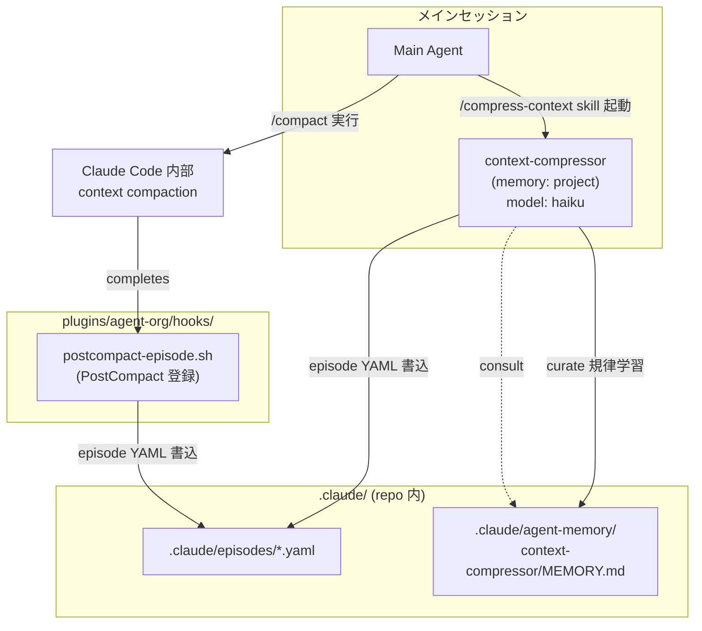

# agent-org Architecture

agent-org plugin の内部設計。Phase 1 範囲のみ記述。Phase 2 以降の設計は
親プラン (`~/.claude/plans/worktools-agent-org-plugin-cooperative-lamport.md`)
参照。

## Phase 1 のコンポーネント関係



## データフロー

### A. PostCompact hook 経由 (自動)

1. ユーザーが `/compact` を実行、または auto-compact が走る
2. compaction 完了後、Claude Code が PostCompact hook を発火
3. hook 入力 JSON に `compact_summary` (string) と `trigger` (manual/auto) が含まれる
4. `hooks/postcompact-episode.sh` が:
   - `compact_summary` を優先抽出 (非空ならそれを使用)
   - 空・欠落時は `transcript_path` を JSONL parse して compact イベントを探す fallback
   - `.claude/episodes/compact-<ISO timestamp>.yaml` に YAML 形式で保存

### B. 手動圧縮 (`/compress-context`)

1. ユーザーが `/compress-context` を実行
2. compress-context command が `compressing-context` skill を起動
3. skill が context-compressor subagent を Task tool で invoke
4. context-compressor が直近の会話セグメントを読み、episode YAML 形式で
   `.claude/episodes/<descriptive-id>.yaml` に保存
5. 終了時に `.claude/agent-memory/context-compressor/MEMORY.md` を curate
   (どの圧縮戦略が効いたか等の知見蓄積)

## Episode YAML スキーマ

両経路 (A/B) で書き出す YAML の標準形式:

```yaml
episode:
  id: <ISO timestamp or descriptive slug>
  trigger: manual | auto | post_compact
  topic: <主題: 1 行で>
  decisions:
    - <決定 1>
    - <決定 2>
  artifacts_changed:
    - path: <ファイルパス>
      summary: <変更要約>
  unresolved:
    - <持ち越し項目>
  retrieval_keys: [<キーワード 1>, <キーワード 2>, ...]
  source:
    type: post_compact | manual_compress
    trigger: <PostCompact 経由なら "manual"/"auto"、手動なら "user_request">
  source_summary: |
    <元の compact_summary または手動圧縮した本文>
```

`retrieval_keys` は将来 grep で episode を発見するための索引語。
context-compressor は learning として「どんな topic にどんな keys が有効か」を
memory に蓄積していく。

## Plugin 制約への対応 (Phase 1 範囲)

- subagent frontmatter から `hooks` / `mcpServers` / `permissionMode` を省略
  (plugin subagent では無視されるため)
- context-compressor の tools 制限は `tools: Read, Write, Edit, Glob, Grep`
  ホワイトリスト方式 (Bash 不要)
- hook script (`postcompact-episode.sh`) は `${CLAUDE_PLUGIN_ROOT}` 経由で参照
  (cache 配置でも壊れない)

## ファイルパス規約 (Phase 1)

| 用途 | パス | 書く側 | 読む側 |
|---|---|---|---|
| Episode YAML | `.claude/episodes/<id>.yaml` | postcompact-episode.sh / context-compressor | メインセッション (Grep retrieval) |
| context-compressor memory | `.claude/agent-memory/context-compressor/MEMORY.md` | context-compressor (curate) | context-compressor 次回起動時 (auto-inject) |

Phase 2 以降で `.claude/agent-memory/decision-keeper/`,
`.claude/agent-org/approvals/`, `~/.claude/agent-org/state/<proj-hash>/` が
追加される (Phase 1 では作らない)。

## Phase 1 で意図的に未実装の領域

- 構造化決定ログ (`decision-keeper` subagent + `recording-decision` skill)
- レビュー権限ゲート (`architect-reviewer` + `running-review` + Stop/TaskCompleted hooks)
- regression 監視/修復 (`regression-watcher` + `regression-fixer` + `/start-watcher`
  / `/fix-regression` commands + post-commit-trigger hook)

詳細は親プラン Phase 2-4 を参照。
