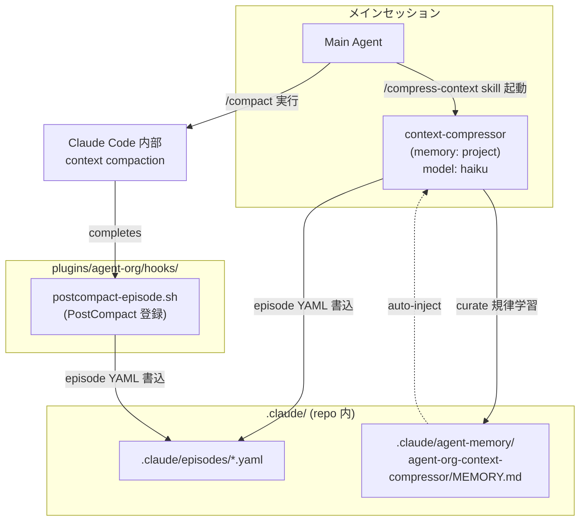
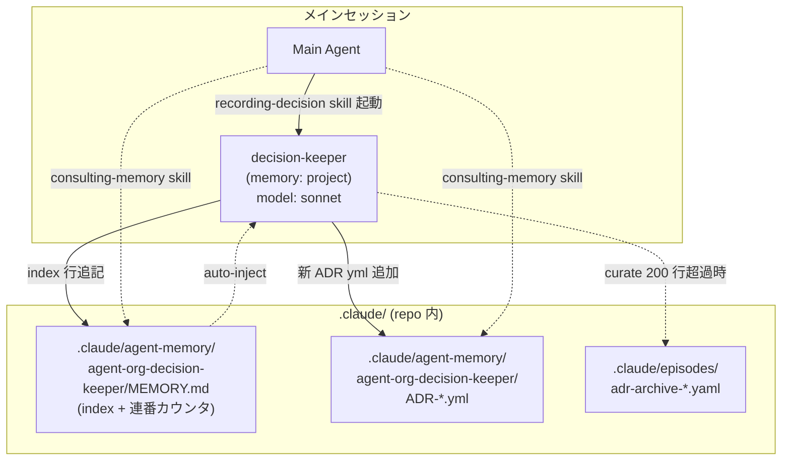
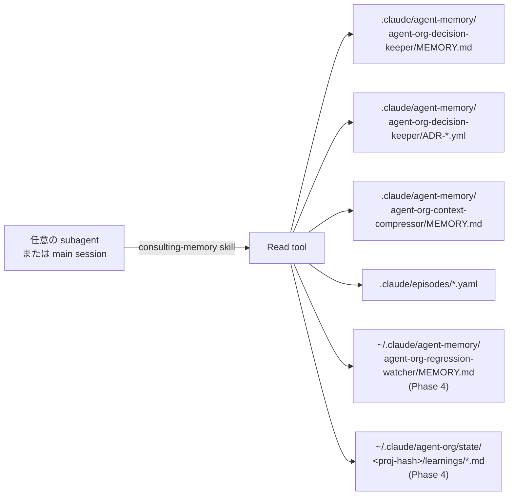
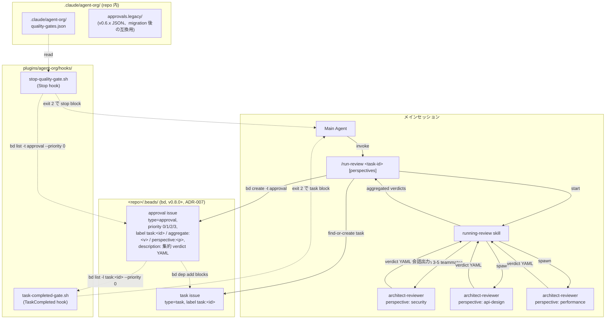
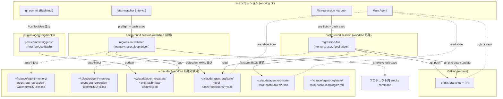
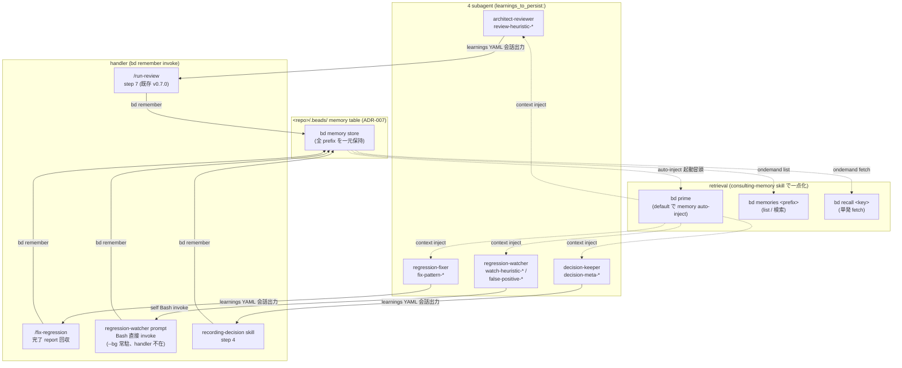

# agent-org Architecture

agent-org plugin の内部設計。Phase 1 + 2 + 3 + 4 全体を記述。v0.5.0 で
親プランの全コンポーネントが揃った状態を反映している
(`~/.claude/plans/worktools-agent-org-plugin-cooperative-lamport.md`)。

## 命名規則: scoped name dir (v0.3.0〜)

Claude Code v2.1.33+ は plugin subagent の memory dir を **scoped name** で
解決する (`<plugin-name>:<agent-name>` の `:` を `-` に置換した命名)。
agent-org plugin のすべての subagent は scoped name dir
(`agent-org-<agent-name>/`) を使う (ADR-003 採用判断、v0.3.0)。

これにより:

- subagent 起動時に MEMORY.md 先頭 200 行/25 KB が自動注入される
- フレームワーク命名と subagent 書込先が一致する
- 明示的な Read による情報注入が不要 (curate された MEMORY.md が常に subagent に届く)

## Phase 1 のコンポーネント関係



## データフロー

### A. PostCompact hook 経由 (自動)

1. ユーザーが `/compact` を実行、または auto-compact が走る
2. compaction 完了後、Claude Code が PostCompact hook を発火
3. hook 入力 JSON に `compact_summary` (string) と `trigger` (manual/auto) が含まれる
4. `hooks/postcompact-episode.sh` が:
   - `compact_summary` を優先抽出 (非空ならそれを使用)
   - 空・欠落時は `transcript_path` を JSONL parse して compact イベントを探す fallback
   - `.claude/episodes/compact-<ISO timestamp>.yaml` に YAML 形式で保存

### B. 手動圧縮 (`/compress-context`)

1. ユーザーが `/compress-context` を実行
2. compress-context command が `compressing-context` skill を起動
3. skill が context-compressor subagent を Task tool で invoke
   (`subagent_type: "agent-org:context-compressor"`)
4. context-compressor は起動時に
   `.claude/agent-memory/agent-org-context-compressor/MEMORY.md` の先頭
   200 行/25 KB が auto-inject され、過去の圧縮戦略を反映できる状態で動く
5. context-compressor が直近の会話セグメントを読み、episode YAML 形式で
   `.claude/episodes/<descriptive-id>.yaml` に保存
6. 終了時に `.claude/agent-memory/agent-org-context-compressor/MEMORY.md` を
   curate (どの圧縮戦略が効いたか等の知見蓄積)

## Episode YAML スキーマ

両経路 (A/B) で書き出す YAML の標準形式:

```yaml
episode:
  id: <ISO timestamp or descriptive slug>
  trigger: manual | auto | post_compact
  topic: <主題: 1 行で>
  decisions:
    - <決定 1>
    - <決定 2>
  artifacts_changed:
    - path: <ファイルパス>
      summary: <変更要約>
  unresolved:
    - <持ち越し項目>
  retrieval_keys: [<キーワード 1>, <キーワード 2>, ...]
  source:
    type: post_compact | manual_compress
    trigger: <PostCompact 経由なら "manual"/"auto"、手動なら "user_request">
  source_summary: |
    <元の compact_summary または手動圧縮した本文>
```

`retrieval_keys` は将来 grep で episode を発見するための索引語。
context-compressor は learning として「どんな topic にどんな keys が有効か」を
memory に蓄積していく。

## Plugin 制約への対応 (Phase 1 範囲)

- subagent frontmatter から `hooks` / `mcpServers` / `permissionMode` を省略
  (plugin subagent では無視されるため)
- context-compressor の tools 制限は `tools: Read, Write, Edit, Glob, Grep`
  ホワイトリスト方式 (Bash 不要)
- hook script (`postcompact-episode.sh`) は `${CLAUDE_PLUGIN_ROOT}` 経由で参照
  (cache 配置でも壊れない)

## ファイルパス規約 (Phase 1)

| 用途 | パス | 書く側 | 読む側 |
|---|---|---|---|
| Episode YAML | `.claude/episodes/<id>.yaml` | postcompact-episode.sh / context-compressor | メインセッション (Grep retrieval) |
| context-compressor memory | `.claude/agent-memory/agent-org-context-compressor/MEMORY.md` | context-compressor (curate) | context-compressor 次回起動時 (auto-inject) |

Phase 2 で `.claude/agent-memory/agent-org-decision-keeper/` (個別 ADR yml 含む) が
追加される。Phase 3 で `.claude/agent-org/approvals/`、Phase 4 で
`~/.claude/agent-org/state/<proj-hash>/` が追加される。
Phase 5 (v0.6.0) で beads database が hard dependency に。
Phase 6 (v0.7.0) で approval が bd 上 (type=approval、`.claude/agent-org/approvals/`
は廃止 / 互換のため retain) に統合された。
v0.8.0 (ADR-007) で bd の物理配置を `~/.beads/<proj-hash>/` から
`<repo>/.beads/` に変更 (repo-local、bd の git worktree-aware 設計を活用)。

## Phase 2 のコンポーネント関係

ADR (Architecture Decision Record) を構造化形式で蓄積する経路:



## consulting-memory による横断参照



## /org-init で作成されるディレクトリ

| パス | 用途 | scope |
|---|---|---|
| `.claude/agent-memory/agent-org-decision-keeper/` | ADR 蓄積 (MEMORY.md + 個別 yml) | project |
| `.claude/agent-memory/agent-org-architect-reviewer/` | (Phase 3 で使用) | project |
| `.claude/agent-memory/agent-org-context-compressor/` | 圧縮戦略学習 | project |
| `.claude/episodes/` | episode YAML + ADR archive | (repo) |
| `.claude/agent-org/approvals/` | (Phase 3〜v0.6.x で approval JSON 保存、v0.7.0 から bd 化、互換のため retain。`/migrate-approvals-to-beads` 実行後は `.claude/agent-org/approvals.legacy/` に mv される) | (repo) |
| `~/.claude/agent-memory/agent-org-regression-watcher/` | (Phase 4 で使用) | user |
| `~/.claude/agent-memory/agent-org-regression-fixer/` | (Phase 4 で使用) | user |
| `~/.claude/agent-org/state/<proj-hash>/detections/` | (Phase 4 で使用) | (home, project-scoped) |
| `~/.claude/agent-org/state/<proj-hash>/fixes/` | (Phase 4 で使用) | (home, project-scoped) |
| `~/.claude/agent-org/state/<proj-hash>/learnings/` | per-agent learnings | (home, project-scoped) |

`<proj-hash>` の生成: cwd を canonicalize して sha256、先頭 8 桁。
複数プロジェクトを跨いでも state が混じらない識別子。

## Phase 2 のファイルパス規約

| 用途 | パス | 書く側 | 読む側 |
|---|---|---|---|
| ADR index + 連番カウンタ | `.claude/agent-memory/agent-org-decision-keeper/MEMORY.md` | decision-keeper | auto-inject で decision-keeper 自身 / consulting-memory skill 経由で他 subagent / main session |
| 個別 ADR | `.claude/agent-memory/agent-org-decision-keeper/ADR-<id>-<slug>.yml` | decision-keeper | consulting-memory skill |
| Archived ADR | `.claude/episodes/adr-archive-<date>.yaml` | decision-keeper (curate 時) | consulting-memory skill |

decision-keeper は ADR を immutable に追記する。`status: superseded_by:<id>`
更新のみ既存 ADR への許容操作。

MEMORY.md は ADR の **index と連番カウンタ** のみを保持し、auto-inject の
200 行/25 KB 制限内に収まるようにする。本文は個別 yml ファイルに分離する。

## Phase 3 のコンポーネント関係 (v0.4.0)

真 RO `architect-reviewer` + 並列 reviewer spawn + approval workflow +
quality gate の経路:



## Phase 3 のデータフロー

### A. multi-perspective review (`/run-review`、v0.7.0 で bd 化)

1. ユーザーが `/run-review PR-42 security,api-design,testability` を実行
2. `/run-review` command が `task:<task_id>` ラベル付き task issue を bd で
   find-or-create (`bd list -l "task:${task_id}" -t task` で検索、不在なら
   `bd create -t task -p 2 -l "task:${task_id}" -l "agent-org"`)
3. command が `running-review` skill を起動
4. skill が `agent-org:architect-reviewer` を 3-5 perspective で
   spawn (agent teams default、Task tool sequential fallback)。
   **Agent Teams は worktree 非隔離** (公式)、かつ Agent tool の
   `isolation:"worktree"` parameter も frontmatter `isolation: worktree`
   も teammate spawn では silent ignore (ADR-008、Claude Code 2.1.150 環境
   実機確定) のため、reviewer の真 RO 規律 (`tools: Read,Glob,Grep`) が
   write 競合回避の必要条件
5. 各 reviewer が真 RO で対象を Read し、verdict YAML を会話に返す
6. skill が verdict を集約サマリとして command に返す
7. command が aggregate_overall → priority マッピング (reject/request_changes=0、
   approve_with_conditions=1、approve=2、informational=3) を計算し、
   `bd create -t approval -p <prio> -l "approval" -l "task:<task_id>"
   -l "agent-org" -l "aggregate:<v>" -l "perspective:<p>"` で approval issue
   を作成。description body に集約 verdict YAML を埋込
8. `bd dep add <task> <approval>` で approval が task を blocks
9. priority=2 (approved) なら approval を close (blocker 解除)
10. reviewer 学習 (`learnings_to_persist`) を `bd remember "review-heuristic: ..."`
    で永続化 (best-effort)
11. ユーザーに結果通知 (status / concern 件数 / approval bd id / task bd id)

### B. TaskCompleted gate (`task-completed-gate.sh`)

公式 hooks docs により TaskCompleted hook input は **全 field が top-level
フラット** (`task_id` / `task_subject` / `task_description` /
`teammate_name` / `team_name`)。`task` key も `metadata` key も無く、
`review_required` のような任意設定 field も schema に存在しない。

このため gate は **bd approval opt-in** で動かす (v0.7.0):

1. メインセッションで `TaskCompleted` が発火 (matcher 非対応・全件発火)
2. hook が input JSON から **top-level `task_id`** を取得
3. `task_id` 不在 (schema 違反) → exit 0 (fail-open)
4. bd CLI / `<repo>/.beads/` 不在 → exit 0 (fail-open)
5. bd で `task:<task_id>` ラベル付き approval (open) を検索:
   `bd list -l "task:${task_id}" -t approval --status open --json
    | jq '[.[] | select(.priority==0)] | length'`
6. 件数が **0** → exit 0 (通常 task、review 不要 / 全 approved or closed)
7. **>0** (priority=0=rejected が open) → exit 2 (block)
8. priority=1 (conditional) が残っている場合は warn (block しない)

→ `/run-review <task-id>` を実行した task のみが gate 対象。それ以外は
通常通り完了する設計。

### C. Stop quality gate (`stop-quality-gate.sh`)

1. メインセッション停止前に `Stop` hook が発火
2. `stop_hook_active=true` なら exit 0 (再入回避)
3. `.claude/agent-org/quality-gates.json` 無ければ exit 0
4. ある場合、各 gate を順次実行:
   - `kind: command`: shell command を eval、exit code 0 でパス
   - `kind: approvals_clean` (v0.7.0): bd 上の rejected approval
     (type=approval, priority=0, open) が 0 件ならパス。
     `bd list -t approval --status open --json
     | jq '[.[] | select(.priority==0)] | length'` で件数取得。
     bd CLI / `<repo>/.beads/` 不在で fail-open (pass)
5. `required: true` の failing は collect、`required: false` は warn のみ
6. failing があれば exit 2 (block)、無ければ exit 0

## Phase 3 のファイルパス規約

| 用途 | パス | 書く側 | 読む側 |
|---|---|---|---|
| approval bd issue (v0.7.0+) | `<repo>/.beads/` 上の `type=approval` issue (label `task:<task_id>` + priority 0/1/2/3 + `aggregate:<v>` + `perspective:<p>` + description body に集約 verdict YAML)。v0.8.0 (ADR-007) で repo-local | `/run-review` command (`bd create -t approval`) | task-completed-gate.sh / stop-quality-gate.sh (approvals_clean) / main session (`(cd <repo> && bd list -l "task:<id>")`) |
| task bd issue (v0.7.0+) | `<repo>/.beads/` 上の `type=task` issue (label `task:<task_id>`、approval/fix の親)。v0.8.0 (ADR-007) で repo-local | `/run-review` find-or-create | approval/fix dep の起点 |
| approval JSON (v0.6.x 互換) | `.claude/agent-org/approvals/<task-id>.json` (v0.7.0 で廃止、`/migrate-approvals-to-beads` で bd 化、旧 JSON は `approvals.legacy/` に mv) | (v0.6.x) `/run-review` command | (v0.6.x) hooks |
| quality-gates 設定 | `.claude/agent-org/quality-gates.json` | ユーザー (手書き) | stop-quality-gate.sh |
| architect-reviewer memory | `.claude/agent-memory/agent-org-architect-reviewer/MEMORY.md` | architect-reviewer (curate 計画は会話出力、書込は command 側) | architect-reviewer 次回起動時 (auto-inject) |

## approval bd issue schema (v0.7.0)

v0.7.0 で approval は bd issue (type=approval) として管理。priority + label
で status を encode、description body に集約 verdict YAML を埋込。

### issue structure

| 項目 | 表現 |
|---|---|
| type | `approval` |
| priority | `0`=rejected (request_changes/reject) / `1`=conditional (approve_with_conditions) / `2`=approved (approve) / `3`=informational |
| 必須 label | `approval` (type marker) / `task:<task_id>` (検索 primary key) / `agent-org` / `aggregate:<approve\|approve_with_conditions\|request_changes\|reject>` |
| 追加 label | `perspective:<persp>` (per reviewer、複数付与可) / `legacy-id:<basename>` (migration 由来の場合) |
| description body | 集約 verdict YAML (下記 schema) |
| dep | `bd dep add <task> <approval>` で approval が task を blocks。再 review 時は `bd dep add <new> <old> --type supersedes` |
| status | open=未解決 (priority=0/1 が gate 対象) / closed=解決 (approved or supersedes 後) |

### description body の verdict YAML schema

```yaml
schema_version: "1"
task_id: PR-42
target:
  type: pr | commit_range | design_doc | implementation
  ref: PR#42
reviewed_at: <ISO-8601 UTC>
reviewer: agent-org/run-review
perspectives_reviewed: [security, api-design, performance]
missing_perspectives: []
aggregate_overall: approve | approve_with_conditions | request_changes | reject
min_confidence: high | medium | low
concerns_summary:
  critical: 0
  major: 1
  minor: 3
  nit: 2
verdicts:
  - perspective: security
    reviewer: architect-reviewer
    overall: approve
    confidence: high
    concerns:
      - id: C1
        severity: minor
        summary: "..."
        detail: "..."
        suggestion: "..."
    strengths: ["..."]
    questions: ["..."]
    references: []
    retrieval_keys: ["..."]
```

### aggregate_overall → priority + label 対応

| aggregate_overall | priority | label (aggregate:) | gate 判定 |
|---|---|---|---|
| `approve` | 2 | `aggregate:approve` | pass (closed) |
| `approve_with_conditions` | 1 | `aggregate:approve_with_conditions` | pass + warn |
| `request_changes` | 0 | `aggregate:request_changes` | block (exit 2) |
| `reject` | 0 | `aggregate:reject` | block (exit 2) |

v0.6.x までの JSON schema (`approval_status: approved|conditional|rejected`)
から migration する場合は `/migrate-approvals-to-beads` を実行。旧 field
`approval_status` は priority に逆引き mapping される。

## quality-gates.json schema (v1)

```json
{
  "schema_version": "1",
  "gates": [
    {
      "id": "tests-passing",
      "description": "Unit tests must pass",
      "kind": "command",
      "command": "pytest -q",
      "required": true
    },
    {
      "id": "no-rejected-approvals",
      "description": "All review approvals must be approved or conditional",
      "kind": "approvals_clean",
      "required": true
    }
  ]
}
```

`kind`:

- `"command"` (default): shell command を `eval` し exit code 0 でパス
- `"approvals_clean"` (v0.7.0): bd 上の rejected approval (type=approval,
  priority=0, open) が 0 件ならパス。`bd list -t approval --status open
  --json | jq '[.[] | select(.priority==0)] | length'` で件数取得。
  v0.6.x までは `.claude/agent-org/approvals/*.json` の
  `approval_status="rejected"` を見ていたが、v0.7.0 から bd query ベース

`required: false` の gate は failing でも block しない (warn のみ)。

## Phase 4 のコンポーネント関係 (v0.5.0)

background session (`--bg`) で常駐する watcher (検出) + fixer (修復) +
commit trigger hook の経路。worktree 隔離の影響を回避するため state は
全て working dir 外 (`~/.claude/...`)、修正成果統合は git remote 経由。



## Phase 4 のデータフロー

### A. background watcher 起動 (`/start-watcher`)

1. main session で `/start-watcher 30m` を実行
2. command が foreground preflight を直接 Bash で実行:
   - `gh` install + auth 済みか
   - `git remote get-url origin` が通るか
   - `claude` CLI が利用可能か
   - `python3` で proj-hash 計算可能か
   - state dir / memory dir を `mkdir -p` で確保
3. preflight 通過後、`claude --agent agent-org:regression-watcher --bg
   "/loop 30m smoke check"` を発射
4. background supervisor が watcher session を立ち上げる
5. watcher は各 iteration で:
   - `~/.claude/agent-org/state/<proj-hash>/last-commit.json` を Read
   - 前回以降 / 新規 commit が無くても定期チェックを実施
   - smoke command を Bash で実行
   - regression を検出したら detection YAML を書く

### B. git commit を契機にした last-commit 更新

1. main session で `git commit ...` を Bash tool 経由で実行
2. `PostToolUse` が発火 (matcher: Bash)
3. `post-commit-trigger.sh` が:
   - `tool_input.command` に `git commit` を含むか確認 (chained `;` / `&&` /
     パイプ越しも検出、`tr ';|&' '\n'` で行分割してから regex 検査)
   - `tool_response.exit_code == 0` を確認
   - command が `git -C <path>` を含めば `<path>` を target dir として
     extract (relative path は cwd 基準で resolve)、resolve できなければ
     cwd フォールバック
   - target dir を canonicalize (`cd && pwd -P`) + sha256 で proj-hash 計算
   - target dir で `git rev-parse HEAD` / `--abbrev-ref HEAD` を取得
   - `~/.claude/agent-org/state/<proj-hash>/last-commit.json` を JSON 書込
     (`cwd` = target dir、`hook_cwd` = hook input の cwd を別 field で保持)
4. watcher の次 `/loop` iteration がこの last-commit.json を読んで起点にする

`git -C <other-repo> commit` のケース: target dir = `<other-repo>` の
proj-hash で書くため、cwd 側の `last-commit.json` には**触らない**。watcher
は cwd ベースで proj-hash を計算するため、別 repo の commit が watcher の
baselining を汚染しない。

### C. background fixer 起動 (`/fix-regression`)

1. main session で `/fix-regression PR#42` を実行
2. command が foreground preflight を直接 Bash で実行:
   - Phase 4-A と同等のチェック + 作業ツリー clean / branch 衝突 /
     `gh repo view` 疎通
3. preflight 通過後、condition を組み立て (target ベースで自動 or 引数指定)、
   末尾に `or stop after N turns` 句を強制付与
4. `claude --agent agent-org:regression-fixer --bg '/goal <condition>'` を発射
5. fixer は `/goal` 評価ループで修正試行を繰り返す
6. 完了時 (goal achieved / turn cap / error):
   - 修正を commit
   - `git push origin <branch>`
   - `gh pr create` または既存 PR への push で更新
   - `~/.claude/agent-org/state/<proj-hash>/fixes/<ts>.json` を書く
7. main session は `gh pr view <URL>` で内容確認

### D. main session から成果を観察

```bash
# 検出一覧
ls -la ~/.claude/agent-org/state/<proj-hash>/detections/
# 修正完了一覧
ls -la ~/.claude/agent-org/state/<proj-hash>/fixes/
# 最新 fix の PR URL を取り出して確認
jq -r '.pr_url' ~/.claude/agent-org/state/<proj-hash>/fixes/<latest>.json | xargs gh pr view
```

## Phase 4 のファイルパス規約

| 用途 | パス | 書く側 | 読む側 |
|---|---|---|---|
| watcher memory (project セクション分離) | `~/.claude/agent-memory/agent-org-regression-watcher/MEMORY.md` | watcher (curate) | watcher 次回起動時 (auto-inject) |
| fixer memory (project セクション分離) | `~/.claude/agent-memory/agent-org-regression-fixer/MEMORY.md` | fixer (curate) | fixer 次回起動時 (auto-inject) |
| last commit pointer | `~/.claude/agent-org/state/<proj-hash>/last-commit.json` | post-commit-trigger.sh | watcher (次 /loop iteration) |
| detection YAML | `~/.claude/agent-org/state/<proj-hash>/detections/<id>.yaml` | watcher | fixer (`/fix-regression`) / main session |
| fix state JSON | `~/.claude/agent-org/state/<proj-hash>/fixes/<id>.json` | fixer (完了時必須) | main session (`gh pr view` の起点) |
| per-agent learnings | `~/.claude/agent-org/state/<proj-hash>/learnings/<agent-name>.md` | watcher / fixer (重い学習を分離) | consulting-memory skill |

`<proj-hash>` の生成: hook input の `cwd` を canonicalize (`cd && pwd -P`)
して sha256 した先頭 8 桁。`$CLAUDE_PROJECT_DIR` 環境変数依存より hook input
の common field の方が堅い (env 未設定でも cwd は必ず渡る)。

## last-commit.json schema (v1)

```json
{
  "schema_version": "1",
  "commit_sha": "<HEAD の sha>",
  "branch": "<branch name>",
  "committed_at": "<ISO-8601 UTC>",
  "cwd": "<canonicalize 済 target dir (= git -C <path> or hook input cwd)>",
  "hook_cwd": "<hook input の cwd (canonicalize 済)>",
  "project_hash": "<proj-hash, target dir の sha256[:8]>",
  "triggered_by": "PostToolUse:Bash",
  "command_excerpt": "<command の先頭 200 文字>"
}
```

`cwd` と `hook_cwd` が異なる場合は `git -C <path>` で別 repo に commit した
ケース (target = path、hook_cwd = main session の cwd)。同じなら通常の
cwd commit。

## detection YAML schema

```yaml
detection:
  id: detection-<ISO ts>
  detected_at: <ISO-8601 UTC>
  project_hash: <proj-hash>
  trigger:
    type: scheduled_loop | post_commit | manual
    last_commit_sha: <sha or null>
    branch: <branch name>
  observation:
    kind: test_failure | build_failure | lint_regression | runtime_error | behavioral_drift | flaky
    severity: critical | major | minor
    summary: <1 行>
    detail: |
      <観察事実>
    location:
      - <ファイル:行 or テスト名>
  evidence:
    - command: <bash command>
      exit_code: <int>
      stdout_excerpt: |
        <抜粋>
      stderr_excerpt: |
        <抜粋>
  reproducible:
    confidence: high | medium | low
    notes: |
      <flaky 疑い等>
  suggested_fix_perspective: |
    <fixer への初期方針ヒント>
  retrieval_keys:
    - <検索キーワード>
  status: pending_fix
```

## fix state JSON schema (v1)

```json
{
  "schema_version": "1",
  "fix_id": "fix-<ISO ts>",
  "started_at": "<ISO-8601 UTC>",
  "completed_at": "<ISO-8601 UTC>",
  "project_hash": "<proj-hash>",
  "trigger": "detection:<id> | manual | pr:<n> | task:<id>",
  "branch": "<branch name>",
  "base_branch": "<例: main>",
  "pr_url": "https://github.com/<owner>/<repo>/pull/<n>",
  "commits": ["<sha1>", "<sha2>"],
  "goal_status": "achieved | turn_limit | error",
  "turns_used": <int>,
  "summary": "<1-2 行>",
  "notes": "<任意>"
}
```

## Worktree 隔離の影響と対策

公式 docs (`agent-view`):

> Every background session ... starts in your working directory but is
> blocked from writing files there. When the session needs to edit files,
> Claude moves it into an isolated git worktree under `.claude/worktrees/`
> automatically. The block doesn't apply ... to writes outside the working
> directory.

agent-org plugin は以下で隔離を回避:

| 用途 | 対策 |
|---|---|
| subagent memory の永続化 | `memory: user` (`~/.claude/agent-memory/...`) |
| detection / fix state 共有 | `~/.claude/agent-org/state/<proj-hash>/` (working dir 外) |
| 修正成果の main 統合 | `git push` + `gh pr create/update` (remote 操作は隔離されない) |
| commit 通知 | main session の Bash tool で commit → PostToolUse(Bash) hook が working dir 外の last-commit.json を更新 |

これにより `--bg` 起動された watcher / fixer の働きが main session から
確実に観察可能になる。

## cross-project 混入対策

`memory: user` の subagent (watcher / fixer) は全プロジェクト共通の memory
領域を使う。複数プロジェクトを跨いだ場合に学習が混在しないよう、subagent
prompt で以下を強制:

- `MEMORY.md` 内では `## Project: <proj-hash>` セクションで分離して書く
- 他プロジェクトのセクションを編集しない
- 重い学習は `~/.claude/agent-org/state/<proj-hash>/learnings/<name>.md` に
  分離 (MEMORY.md 短縮 + auto-inject 制限内に収める)

## /goal 暴走ガード

`/goal` には docs に hard cap が無い (`stop_hook_active` field による再入
検出が前提)。実装は **condition 末尾に `or stop after N turns` 句を強制**
することで bound する:

- `/fix-regression` command がこの句を必ず付与
- default turn-cap: small=25 / medium=50 / large=80
- `--turn-cap N` で明示上書き、上限 100

fixer 自身も「turn が cap の 90% に近づいたら停止」する保守動作を prompt
に含めている。

## Phase 4 で意図的に未実装の領域

- watcher / fixer のテレメトリ (run 回数 / 平均修正所要時間 / 成功率)
  集計ダッシュボード
- 複数 fixer 並列起動 (現状は detection-id 単位の sequential を想定)
- v1.0.0 凍結に向けた実機運用フィードバックの反映

これらは v0.6.x 系で段階的に追加検討。

## v0.3.0 破壊的変更 (ADR-003)

v0.2.x までは plain name dir (`.claude/agent-memory/decision-keeper/` 等) を
subagent の書込先としていたが、scoped name dir
(`.claude/agent-memory/agent-org-decision-keeper/` 等) で auto-inject が
動作することを実機検証 (PoC 2026-05-17) し、v0.3.0 で全 subagent を scoped name
dir に統一した。

旧 plain dir → 新 scoped dir のデータ移行は `/org-init` のドキュメント参照。

明示注入設計 (skill 側で「既存 ADR 連番を Read で取得して prompt に含める」)
は v0.3.0 で廃止。subagent 自身が auto-inject 経由で MEMORY.md を読む構造に
統一された。

## Phase 7+ のコンポーネント関係 (v0.10.0、ADR-010)

cross-session 学習機構を 4 subagent に展開する。`bd remember` / `bd recall` /
`bd memories` / `bd forget` (bd 1.0.4+ の learning store) を `<repo>/.beads/`
配下の memory table に書込、`bd prime` の default 挙動で次セッションに
auto-inject する設計 (ADR-010)。Phase 6 (v0.7.0) で architect-reviewer +
`/run-review` で prototype 化していた経路を 4 subagent に拡張。



## Phase 7+ の key 命名規約

prefix で書き手 subagent を識別する規約。機械検証なし、subagent prompt + skill
+ handler が convention で守る。`bd memories <prefix>` で絞込検索する想定。

| subagent | key prefix | 例 | 経路 |
|---|---|---|---|
| `architect-reviewer` | `review-heuristic-` | `review-heuristic-mock-only-tests` | handler 経由 (`/run-review` step 7、v0.7.0 既存) |
| `regression-fixer` | `fix-pattern-` | `fix-pattern-jsonl-parse-eof` | handler 経由 (`/fix-regression` 完了 report 回収) |
| `regression-watcher` | `watch-heuristic-` / `false-positive-` | `watch-heuristic-go-test-short-flag` / `false-positive-clock-skew-flaky` | subagent prompt 内 Bash 直接 invoke (`--bg` 常駐性質、handler 不在) |
| `decision-keeper` | `decision-meta-` | `decision-meta-supersede-pattern` | handler 経由 (`recording-decision` skill step 4) |

`<slug>` は kebab-case、英数字 + ハイフンのみ。同 key 再 `bd remember` で
update in place (bd 1.0.4 仕様)。

## Phase 7+ のデータフロー

### A. 4 subagent が learning を返す → handler が bd remember

1. subagent が動作 (review / fix / watch / decision の各 cycle)
2. cycle 末尾で **`learnings_to_persist:` YAML** を会話出力に添える (各 prefix
   に従って `kind` / `summary` / `retrieval_keys` / `suggested_key` を書く)
3. handler (`/run-review` / `/fix-regression` / `recording-decision` skill)
   が会話出力から `learnings_to_persist` を回収
4. 各行を `bd remember "<prefix>: <summary>" --key <prefix>-<slug>` で永続化
   (失敗時は `|| true` で best-effort)
5. handler は本来の責務 (approval issue 作成 / fix close 確認 / ADR 保存)
   を完了

**watcher だけ例外**: `--bg` 常駐性質で handler が launch 後に介入できない
ため、subagent prompt 内 Bash で **直接 `bd remember` を invoke する**
(ADR-010 で明示的に分業の例外として確定)。

### B. 次セッションで auto-inject

1. 4 subagent のいずれかを次回起動 (foreground / `--bg` 問わず)
2. 起動冒頭で `bd prime` を実行 (`using-beads` skill の規律)
3. `bd prime` の default 挙動で memory が context に **auto-inject** される
   (bd 1.0.4: "Memories are injected at prime time")
4. subagent は **追加の `bd recall` 呼出をせずに** 過去 learning にアクセス可能

→ Phase 7+ retrieval は **追加 hook / Bash 呼出ゼロ**で達成。bd 1.0.4 の
`bd prime` default 挙動を活用する設計。

### C. 横断 retrieval (consulting-memory skill 経由)

明示 retrieval が必要なケース (別 prefix の learning を検索したい、`bd prime`
inject 範囲を超えた古い learning を見たい、main session から特定 key を深掘
りしたい等) は `consulting-memory` skill の手順 7 で実施:

```bash
# prefix で絞込 list
(cd "$REPO_ROOT" && bd memories fix-pattern)

# 個別 key fetch
(cd "$REPO_ROOT" && bd recall fix-pattern-jsonl-parse-eof)
```

詳細は `skills/consulting-memory/SKILL.md` の「key 命名規約」table、
および `skills/using-beads/SKILL.md` の「### 9. learning store の使い方」。

## Phase 7+ のファイルパス規約

| 用途 | パス | 書く側 | 読む側 |
|---|---|---|---|
| bd memory store | `<repo>/.beads/` 配下の memory table (bd 1.0.4 default) | 4 subagent + 各 handler が `bd remember` | `bd prime` (auto-inject) / `bd memories` / `bd recall` |

ADR-007 (`<repo>/.beads/` repo-local 配置) と整合。`--global`
(`beads_global` 共通 store) は使わない (cross-project leak 回避、worktree-
aware 動作の維持、YAGNI)。詳細は `skills/using-beads/SKILL.md` の
「`--global` (`beads_global` 共通 store) は使わない (ADR-010)」section 参照。

## Phase 7+ で意図的に未実装の領域

- ~~lint script (key 命名規約の機械検証)~~: **v0.11.0 で実装済み**
  (`scripts/lint-bd-keys.sh`)。`bd memories` 出力の prefix 違反と
  slug の非 kebab-case を検出する
- **auto-prune / TTL**: 古い learning が `bd memories` 検索結果を埋める
  実害が発生したら ADR-011 等で再検討。現状は `bd forget <key>` の手動削除
- **`--global` (cross-project shared store)**: project 横断学習の実需要が
  発生したら新規 ADR で導入検討。本 release は YAGNI で project-local 一本化
- **lint で missing learning を検出**: 「fixer が完了したのに
  `learnings_to_persist:` が空」のような curate 漏れ検出。subagent 自身の
  判断 (ondemand 投入) を尊重し、機械強制は行わない

これらは v0.10.x 系で運用フィードバック反映と並行して検討。

## v0.11.0: v2 skill 統合 (command → skill 移行)

v0.11.0 で workflow command を skill に統合し、ユーザーが明示的なコマンド
指定なしで Claude が文脈から自動起動する設計に移行。

### 移行マッピング

| 旧 command | 新 skill | 状態 |
|---|---|---|
| `/run-review` | `running-review` | v0.10.1 (V9) で移行済み |
| `/fix-regression` | `fixing-regression` | v0.11.0 で移行 |
| `/start-watcher` | `starting-watcher` | v0.11.0 で移行 |
| `/compress-context` | `compressing-context` | v0.11.0 で deprecated 化 (skill は既存) |

### command として残すもの (auto-trigger 不要)

| command | 理由 |
|---|---|
| `/org-init` | 初期化は明示実行 |
| `/bd-check` | diagnostic は明示実行 |
| `/migrate-*` (4 種) | one-shot migration は明示実行 |

### 設計原則

- skill に persist ロジックを統合し、呼び出し経路に関わらず同一挙動を保証
- deprecated workflow command は v1.0.0 で削除済み (T1)
- skill の `Triggers:` で auto-trigger 条件を宣言 (Claude が文脈から判断)
