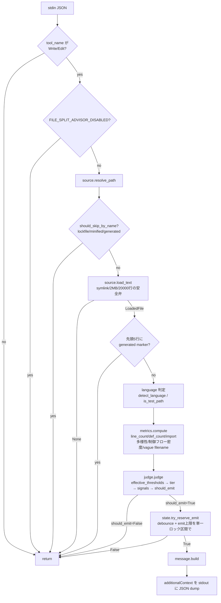

# file-split-advisor (実装者向けガイド)

このファイルは **plugin の保守・拡張者向け**。利用者向け概要は
[../../README.md](../../README.md)。

## 目的と非目的

### 目的

1. `Write` / `Edit` 直後に、行数と構造シグナルを組み合わせてファイル分割の
   検討を促す advisory メモを `additionalContext` で返す
2. 言語ごとの記述密度・ファイルの役割 (ロジック/宣言的/型定義/生成コード/
   テスト) によって適正な長さが変わることを閾値調整で反映する
3. 同一セッション内で同一ファイル×同一 tier への再警告を避け、通知疲れを防ぐ

### 非目的

- **block/deny はしない**。判断材料の提示のみ (advisor であり guardrail では
  ない)
- **git 履歴ベースのシグナル (著者数・コミット頻度) は v1 に含まない**。静的
  解析のみ
- **`line_count` が `note` 閾値未満のファイルの責務混在検出は範囲外**。構造
  シグナルが何個点火していても、行数が小さければ emit しない
- **閾値のローカル上書き機構 (`config.local.json` 等) は v1 に含まない**。
  `sensitive-files-guardrail/patterns.local.txt` の運用実績から保守コストは
  分かっているが、v1 は誰にも使われておらず何をチューニングしたいかの実証
  データがない (YAGNI)。追加するなら全閾値上書きより path-ignore リストの方が
  需要を見積もりやすいと想定している

## ディレクトリ構成

```
file-split-advisor/
├── .claude-plugin/plugin.json
├── README.md                       利用者向け概要
├── CHANGELOG.md
└── hooks/
    ├── hooks.json                  PostToolUse, matcher: "Write|Edit"
    └── file-split-advisor/
        ├── __main__.py             エントリポイント、パイプライン統括、fail-open
        ├── CLAUDE.md                本ファイル
        ├── source.py                 I/O 境界: パス解決・早期 skip・安全な読み込み
        ├── language.py                純粋関数: 言語判定・test判定・generated判定・vague filename
        ├── metrics.py                  純粋関数: テキスト → 数値メトリクス
        ├── judge.py                     純粋関数: 閾値テーブル・tier/emit 判定
        ├── state.py                      唯一の I/O 副作用: session_id ベース debounce store
        ├── message.py                     additionalContext 文面組み立て
        └── tests/
```

`source.py` を独立させている理由: `language.py`/`metrics.py`/`judge.py` を
純粋関数のまま保ちモックなしでテストできるようにするため
(`session-facts` の `core/fs.py` と `collectors/*.py` の分離、
`redact-sensitive-reads` の `core/safepath.py` と `redaction/*.py` の分離と
同じ発想)。

## 判定パイプライン



## 判定ロジックの設計判断

### review 以上は signal 数によらず常に emit する

`judge.py::judge()` の emit 判定は、tier が `review`/`warn`/`strong` なら
構造シグナルの有無を問わず emit する。見落としではなく意図的な設計判断:
ユーザー提示の参考資料自身が「300 行超はレビューを促す」「500-800 行は分割
候補」「800 行超は設計再確認」と、**大きさそのものを review 発火の十分条件と
して扱っている**ことに整合させたもの。

構造シグナルは「行数判定を上書きする独立ゲート」にはせず、代わりに (1) 言語/
role 係数・宣言的緩和という形で `effective_thresholds` 自体に織り込み、(2)
`note` tier (150〜300 相当) の昇格判定 (シグナル 2 個以上で emit) という 2 箇所
で行数評価の解像度を上げる役割に限定している。透明性確保のため、`message.py`
は signal_count==0 で emit された場合 (行数のみが根拠) は「検出された構造
シグナル: なし」と明示する。

### `Metrics` に `import_categories` (カテゴリ名のタプル) を追加した理由

計画時点の `Metrics` フィールド列挙は `import_category_count` (件数) のみだった
が、`message.py` が「import カテゴリ多様性 5種 (network, db, ui, logging,
auth)」とカテゴリ名を列挙するには件数だけでは足りない。`message.build` は
`path/language/role/verdict/metrics` の 5 引数のみで生テキストにはアクセス
しないため、`metrics.py` 側でカテゴリ名を保持する以外に経路がない。
`import_category_count` は `judge.py` のシグナル閾値判定 (`>= 4`) に使うため
両方のフィールドを残す。

### `def_count_exact` フィールドは実装しなかった

計画の `Metrics(...)` 列挙に一度だけ登場するが、`judge.py`/`message.py`/テスト
計画のいずれにも対応する消費者が見当たらない。「AST exact か regex fallback
か」を示す品質フラグの意図だった可能性はあるが未配線のため、未使用フィールド
として残すのは冗長と判断し実装していない。`count_defs_python()` は AST 解析に
失敗すると `None` を返し、呼び出し側が generic regex にフォールバックする制御
フローのみ実装している。

### `message.build` の `path` 引数は表示用パスを呼び出し側で解決

`message.build(path, language, role, verdict, metrics)` は cwd を受け取らない
(計画の 5 引数シグネチャそのまま)。相対パス表示にしたい場合は `__main__.py`
側で `path.relative_to(cwd)` を試み、失敗時 (cwd 外) は絶対パスにフォール
バックしてから `message.build` に渡す。`message.py` 自体は cwd を一切知らない。

### `role` 引数はテストファイルの閾値緩和を可視化する用途で使用

`message.build` の `role` 引数は計画のシグネチャに含まれているが、計画が示す
2 つの出力例 (いずれも role=="normal" 相当) では表示に現れない。未使用の死んだ
引数にしないため、`role == "test"` のときだけ見出し行に `(test: 閾値 1.6倍)`
を追記する形で使っている。`role=="normal"` の出力は計画の例と完全一致する。

## debounce (`state.py`)

MainClaude/Subagent が並行して複数ファイルを Write/Edit する運用を想定すると、
同一セッションの state ファイルへの read-modify-write はロックなしでは競合
する。「debounce 判定」と「emit 実行後の記録」を別々の呼び出しに分けると、2 つ
の呼び出しの間に別プロセスが割り込む TOCTOU (check-then-act) レースが生じうる。
この repo には同型の問題 (レビュー回数の並行予約) に対する実装済みの前例
`external-ai-assist/hooks/exitplan-review/__main__.py::reserve_slot`
(`fcntl.flock` で read→判定→write を単一ロック区間に収める) があり、これを
踏襲した `try_reserve_emit()` に「判定」と「予約」を統合している。

`reserve_slot` との差分:

- **session_id をハッシュ化してファイル名にする** (`hashlib.sha256(...)
  .hexdigest()[:16]`)。`/` や `..` を含む session_id が万一渡ってきても
  `TMPDIR` 外への書き込みや例外につながらない
- **`import fcntl` をモジュールトップレベルで無条件に行わない**。
  `exitplan-review` は無条件 import で、Windows では `main()` 到達前の
  モジュールロード時に未捕捉 `ImportError` で丸ごとクラッシュする潜在バグが
  ある。本 hook は advisory であり security-critical ではないため、「ロック
  なしで動作継続」に degrade する方が「ロックはあるが起動不能」より適切、と
  判断して `try/except ImportError` + `HAVE_FLOCK` フラグに変更した

## テスト実行

```bash
cd hooks/file-split-advisor
python3 -m unittest discover tests
```

`tests/_testutil.py` が plugin dir を sys.path に挿入する (unittest discover
経由)。`tests/conftest.py` は pytest 実行時の同型セーフティネット。

## 手動スモークテスト

```bash
cd hooks/file-split-advisor
echo '{"session_id":"smoke","cwd":"'"$PWD"'","tool_name":"Write",
"tool_input":{"file_path":"/tmp/big.py","content":"..."}}' \
  | python3 .
```

事前に `/tmp/big.py` に 300 行超・import 多様性ありの Python ファイルを置いて
おくと `additionalContext` 付き JSON が stdout に出る。閾値未満なら無出力。

## 拡張ポイント

- **path-ignore リスト**: 「このパスは無視する」という需要が見えたら
  `source.should_skip_by_name` の並びに追加するのが次の一手候補 (config.local
  的な全閾値上書きより先に検討する)
- **新しい import カテゴリ / キーワード**: `metrics.py::IMPORT_CATEGORY_KEYWORDS`
  に追記する。カテゴリ自体を増やす場合は `judge.py::IMPORT_DIVERSITY_SIGNAL_THRESHOLD`
  (現状 7 カテゴリ中 4 種) も見直す
- **新しい言語**: `language.py::EXTENSION_LANGUAGE` に拡張子を追加し、
  `judge.py::LANGUAGE_MULTIPLIER` に係数を追加する (未登録なら `generic` = 1.0
  にフォールバック)

## 依存関係

標準ライブラリのみ。`pip install` 不要。Python 3.9+ 想定
(`from __future__ import annotations` + PEP 604 スタイルの型ヒントを
`__future__` import 経由で使用)。
