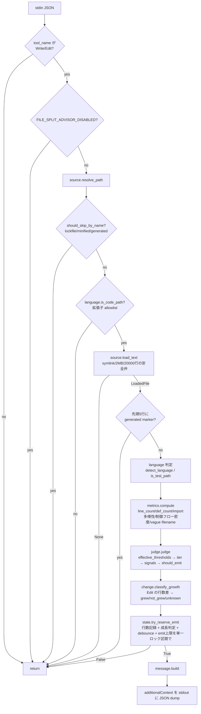

# file-split-advisor (実装者向けガイド)

このファイルは **plugin の保守・拡張者向け**。利用者向け概要は
[../../README.md](../../README.md)。

## 目的と非目的

### 目的

1. `Write` / `Edit` 直後に、行数と構造シグナルを組み合わせてファイル分割の
   検討を促す advisory メモを `additionalContext` で返す
2. 言語ごとの記述密度・ファイルの役割 (ロジック/宣言的/型定義/生成コード/
   テスト) によって適正な長さが変わることを閾値調整で反映する
3. 同一セッション内で同一ファイル×同一 tier への再警告を避け、通知疲れを防ぐ

### 非目的

- **block/deny はしない**。判断材料の提示のみ (advisor であり guardrail では
  ない)
- **git 履歴ベースのシグナル (著者数・コミット頻度) は v1 に含まない**。静的
  解析のみ
- **`line_count` が `note` 閾値未満のファイルの責務混在検出は範囲外**。構造
  シグナルが何個点火していても、行数が小さければ emit しない
- **閾値のローカル上書き機構 (`config.local.json` 等) は v1 に含まない**。
  `sensitive-files-guardrail/patterns.local.txt` の運用実績から保守コストは
  分かっているが、v1 は誰にも使われておらず何をチューニングしたいかの実証
  データがない (YAGNI)。追加するなら全閾値上書きより path-ignore リストの方が
  需要を見積もりやすいと想定している

## ディレクトリ構成

```
file-split-advisor/
├── .claude-plugin/plugin.json
├── README.md                       利用者向け概要
├── CHANGELOG.md
└── hooks/
    ├── hooks.json                  PostToolUse, matcher: "Write|Edit"
    └── file-split-advisor/
        ├── __main__.py             エントリポイント、パイプライン統括、fail-open
        ├── CLAUDE.md                本ファイル
        ├── source.py                 I/O 境界: パス解決・早期 skip・安全な読み込み
        ├── language.py                純粋関数: 拡張子 allowlist・言語判定・test判定・generated判定・vague filename
        ├── metrics.py                  純粋関数: テキスト → 数値メトリクス
        ├── judge.py                     純粋関数: 閾値テーブル・tier/emit 判定
        ├── change.py                     純粋関数: tool_input → 編集がファイルを大きくしたか
        ├── state.py                       唯一の I/O 副作用: session_id ベース debounce store
        ├── message.py                      additionalContext 文面組み立て
        └── tests/
```

`source.py` を独立させている理由: `language.py`/`metrics.py`/`judge.py` を
純粋関数のまま保ちモックなしでテストできるようにするため
(`session-facts` の `core/fs.py` と `collectors/*.py` の分離、
`redact-sensitive-reads` の `core/safepath.py` と `redaction/*.py` の分離と
同じ発想)。

## 判定パイプライン


```mermaid
flowchart TD
    A[stdin JSON] --> B{tool_name が<br/>Write/Edit?}
    B -- no --> Z[return]
    B -- yes --> C{FILE_SPLIT_ADVISOR_DISABLED?}
    C -- yes --> Z
    C -- no --> D[source.resolve_path]
    D --> E{should_skip_by_name?<br/>lockfile/minified/generated}
    E -- yes --> Z
    E -- no --> N{language.is_code_path?<br/>拡張子 allowlist}
    N -- no --> Z
    N -- yes --> F[source.load_text<br/>symlink/2MB/20000行の安全弁]
    F -- None --> Z
    F -- LoadedFile --> G{先頭5行に<br/>generated marker?}
    G -- yes --> Z
    G -- no --> H[language 判定<br/>detect_language / is_test_path]
    H --> I[metrics.compute<br/>line_count/def_count/import多様性/制御フロー密度/vague filename]
    I --> J[judge.judge<br/>effective_thresholds → tier → signals → should_emit]
    J --> P[change.classify_growth<br/>Edit の行数差 → grew/not_grew/unknown]
    P --> K[state.try_reserve_emit<br/>行数記録 + 成長判定 + debounce + emit上限を単一ロック区間で]
    K -- False --> Z
    K -- True --> L[message.build]
    L --> M[additionalContext を stdout に JSON dump]
```

**tier が `ok` でも `try_reserve_emit` を呼ぶ**。judge の結果で打ち切ると、
縮んで `ok` に戻ったファイルの行数記録が古いまま残り、その後の再成長が
「記録より小さい」と誤判定されて抑制される (900 行を記録 → 100 行に縮む →
600 行に成長、で 600 < 900 とみなされる)。`emit_candidate=False` を渡せば
記録だけ行って False が返る。

## 判定ロジックの設計判断

### 「行数だけで emit」は warn 以上に限定する (0.2.0 で変更)

0.1.0 は tier が `review`/`warn`/`strong` なら構造シグナルの有無を問わず emit
していた。ユーザー提示の参考資料が「300 行超はレビューを促す」「500-800 行は
分割候補」「800 行超は設計再確認」と大きさそのものを発火条件として扱っている
ことに整合させた設計判断だったが、**実測すると通知の大半 (63 件中 55 件) が
シグナル 0 件**で、この repo の tracked file の 20% が初回編集で発火していた。

0.2.0 では「大きさそのものが十分条件」を `warn` 以上に引き上げ、`review` は
シグナル 1 個以上を要求する。あわせて Python の言語係数を 0.7 → 1.0 に戻した
(0.7 では review 閾値が 210 行で、pylint の `too-many-lines` 既定 1000 や
ESLint の `max-lines` 既定 300 と比べて突出して厳しかった)。実測値の前後比較は
CHANGELOG 0.2.0 に記録している。

構造シグナルは依然として「行数判定を上書きする独立ゲート」ではなく、(1) 言語/
role 係数・宣言的緩和という形で `effective_thresholds` 自体に織り込み、(2)
`note` tier の昇格判定 (シグナル 2 個以上)、(3) `review` tier の昇格判定
(シグナル 1 個以上) という 3 箇所で行数評価の解像度を上げる役割に限定している。
透明性確保のため、`message.py` は signal_count==0 で emit された場合 (warn/strong
のみ) は「検出された構造シグナル: なし」と明示する。

### `EXTENSION_LANGUAGE` を判定対象の allowlist に兼用する (0.2.0)

`language.py::is_code_path()` は `path.suffix.lower() in EXTENSION_LANGUAGE` を
返すだけ。denylist (`.md` / `.json` / … を列挙して弾く) ではなく allowlist に
したのは、未知の拡張子が現れたときの失敗方向を「通知しない」に倒すため
(advisory hook の `fail-open` = 通知しない側、という設計原則に合わせている)。

代償として **拡張子を持たない shebang スクリプトも判定対象から外れる**。
`is_code_path` は内容を読む前に呼ばれる名前だけの判定なので、shebang を見る
なら `source.load_text` の後に判定を移す設計変更が要る。0.2.0 では行っていない。

新しい言語を追加するときは `EXTENSION_LANGUAGE` に拡張子を足せば判定対象に
入る。`judge.py::LANGUAGE_MULTIPLIER` への追加は任意で、未登録なら 1.0。

### `Metrics` に `import_categories` (カテゴリ名のタプル) を追加した理由

計画時点の `Metrics` フィールド列挙は `import_category_count` (件数) のみだった
が、`message.py` が「import カテゴリ多様性 5種 (network, db, ui, logging,
auth)」とカテゴリ名を列挙するには件数だけでは足りない。`message.build` は
`path/language/role/verdict/metrics` の 5 引数のみで生テキストにはアクセス
しないため、`metrics.py` 側でカテゴリ名を保持する以外に経路がない。
`import_category_count` は `judge.py` のシグナル閾値判定 (`>= 4`) に使うため
両方のフィールドを残す。

### `def_count_exact` フィールドは実装しなかった

計画の `Metrics(...)` 列挙に一度だけ登場するが、`judge.py`/`message.py`/テスト
計画のいずれにも対応する消費者が見当たらない。「AST exact か regex fallback
か」を示す品質フラグの意図だった可能性はあるが未配線のため、未使用フィールド
として残すのは冗長と判断し実装していない。`count_defs_python()` は AST 解析に
失敗すると `None` を返し、呼び出し側が generic regex にフォールバックする制御
フローのみ実装している。

### `message.build` の `path` 引数は表示用パスを呼び出し側で解決

`message.build(path, language, role, verdict, metrics)` は cwd を受け取らない
(計画の 5 引数シグネチャそのまま)。相対パス表示にしたい場合は `__main__.py`
側で `path.relative_to(cwd)` を試み、失敗時 (cwd 外) は絶対パスにフォール
バックしてから `message.build` に渡す。`message.py` 自体は cwd を一切知らない。

### `role` 引数はテストファイルの閾値緩和を可視化する用途で使用

`message.build` の `role` 引数は計画のシグネチャに含まれているが、計画が示す
2 つの出力例 (いずれも role=="normal" 相当) では表示に現れない。未使用の死んだ
引数にしないため、`role == "test"` のときだけ見出し行に `(test: 閾値 1.6倍)`
を追記する形で使っている。`role=="normal"` の出力は計画の例と完全一致する。

## debounce (`state.py`)

MainClaude/Subagent が並行して複数ファイルを Write/Edit する運用を想定すると、
同一セッションの state ファイルへの read-modify-write はロックなしでは競合
する。「debounce 判定」と「emit 実行後の記録」を別々の呼び出しに分けると、2 つ
の呼び出しの間に別プロセスが割り込む TOCTOU (check-then-act) レースが生じうる。
この repo には同型の問題 (レビュー回数の並行予約) に対する実装済みの前例
`external-ai-assist/hooks/exitplan-review/__main__.py::reserve_slot`
(`fcntl.flock` で read→判定→write を単一ロック区間に収める) があり、これを
踏襲した `try_reserve_emit()` に「判定」と「予約」を統合している。

`reserve_slot` との差分:

- **session_id をハッシュ化してファイル名にする** (`hashlib.sha256(...)
  .hexdigest()[:16]`)。`/` や `..` を含む session_id が万一渡ってきても
  `TMPDIR` 外への書き込みや例外につながらない
- **`import fcntl` をモジュールトップレベルで無条件に行わない**。
  `exitplan-review` は無条件 import で、Windows では `main()` 到達前の
  モジュールロード時に未捕捉 `ImportError` で丸ごとクラッシュする潜在バグが
  ある。本 hook は advisory であり security-critical ではないため、「ロック
  なしで動作継続」に degrade する方が「ロックはあるが起動不能」より適切、と
  判断して `try/except ImportError` + `HAVE_FLOCK` フラグに変更した

### 行数の記録と「tier を進めない抑制」 (0.2.0)

パスごとの記録が tier 文字列から `{"tier": ..., "lines": ...}` に変わった
(0.1.0 が書いた文字列形式も `_read_record` が引き続き読む)。`Write` は編集前の
内容が hook に渡らないため、直近に観測した行数を比較対象として使う。

**行数は通知の有無に関わらず記録するが、tier は通知したときだけ進める。**
これを取り違えると、typo 修正で抑制した編集が `tier=strong` を記録してしまい、
その後にそのファイルが本当に成長しても「同一 tier」とみなされてセッション内で
恒久的に抑制される。`state.py::try_reserve_emit` の `granted` と `record` の
分岐、および `tests/test_main.py::TestGrowthGate` の
`test_suppressed_edit_does_not_consume_the_tier_high_water_mark` で固定している。

成長方向が `UNKNOWN` (Write、または `old_string`/`new_string` が無い・型が違う
Edit) のときは、記録があれば行数比較で決め、記録が無ければ通知する。envelope の
形が将来変わったときに通知が黙って全滅するより、0.1.0 と同じ挙動に戻す方を選ぶ。

### `change.py`: 改行数の差 ≠ 行数の差 (ファイル末尾だけ)

行数は `splitlines()` で数えるため「改行で終わらない最終行」が 1 行として
数えられるが、改行の個数はこれを含まない。したがって **ファイル末尾の置換が
改行終端の有無を変える場合だけ**、改行数の差と行数の差が 1 ずれる:

| 末尾の置換 | 改行数の差 | 実際の行数の差 |
|---|---|---|
| `"foo\n"` → `"foo\nbar"` | 0 | **+1** |
| `"foo"` → `"foo\n"` | +1 | **0** |

末尾以外の置換では、置換前後のテキストの末尾が変わらないため差は一致する。

`classify_growth` は編集後の全文 (`loaded.text`) を受け取り、**置換が末尾で
起きたと確定できるときだけ**「置換前の末尾テキスト」を復元して補正する。
確定条件は `text.find(new) == tail_start == text.rfind(new)` — つまり
`new_string` が全文にちょうど 1 箇所しか現れず、それが末尾にあること。

`text.endswith(new)` だけでは不十分。**別の場所を置換した結果、たまたま同じ
文字列が末尾にも並ぶ**ことがあるため。例: `"X\nsomething\nfoo\n"` の先頭 `X` を
`"foo\n"` に置換すると 3 行 → 4 行に増えるが、結果 `"foo\n\nsomething\nfoo\n"`
の末尾にも元からの `"foo\n"` がある。ここで補正すると増加分が打ち消されて
`NOT_GREW` になり、通知が消える (`count()` は重複を数えないので
`find`/`rfind` の一致で判定する)。

確定できないときと全文を渡さない呼び方では、改行数の差による近似に戻る
(末尾で改行終端が変わる場合に 1 ずれうる)。`tests/test_change.py` で
補正あり・補正なし・確定できない場合の 3 通りを固定している。

## テスト実行

```bash
cd hooks/file-split-advisor
python3 -m unittest discover tests
```

`tests/_testutil.py` が plugin dir を sys.path に挿入する (unittest discover
経由)。`tests/conftest.py` は pytest 実行時の同型セーフティネット。

## 手動スモークテスト

```bash
cd hooks/file-split-advisor
echo '{"session_id":"smoke","cwd":"'"$PWD"'","tool_name":"Write",
"tool_input":{"file_path":"/tmp/big.py","content":"..."}}' \
  | python3 .
```

事前に `/tmp/big.py` に 300 行超・import 多様性ありの Python ファイルを置いて
おくと `additionalContext` 付き JSON が stdout に出る。閾値未満なら無出力。

## 拡張ポイント

- **path-ignore リスト**: 「このパスは無視する」という需要が見えたら
  `source.should_skip_by_name` の並びに追加するのが次の一手候補 (config.local
  的な全閾値上書きより先に検討する)
- **新しい import カテゴリ / キーワード**: `metrics.py::IMPORT_CATEGORY_KEYWORDS`
  に追記する。カテゴリ自体を増やす場合は `judge.py::IMPORT_DIVERSITY_SIGNAL_THRESHOLD`
  (現状 7 カテゴリ中 4 種) も見直す
- **新しい言語**: `language.py::EXTENSION_LANGUAGE` に拡張子を追加する
  (= 判定対象に入る)。`judge.py::LANGUAGE_MULTIPLIER` への係数追加は任意で、
  未登録なら 1.0

## 発火率を変える変更をしたときの測定

閾値・シグナル・skip 条件を触ったら、**変更前後の実コードで同じコーパスを流して
通知件数を比較する**。「新しい判定が動くこと」は単体テストで確認できるが、
「旧版が拾えていた入力を落としたこと」は前後比較でしか分からない。

手順は「repo の全 tracked file に対して `should_skip_by_name` →
`is_code_path` → `load_text` → `is_generated_by_content` → `compute` →
`judge` を流し、1 ファイル 1 レコードで結果を出す」だけ。state (debounce) は
通さない (= 「そのファイルをセッション内で初めて編集したときに通知が出るか」を
測る)。差分は「意図した変更 / 改善 / 説明不能」に分類し、説明不能をゼロにする。

0.2.0 の測定結果は CHANGELOG に記録している。編集内容に依存する成長判定
(`change.py`) の効果はこの走査には現れないので、別途 `tests/test_main.py::
TestGrowthGate` で固定する。

## 依存関係

標準ライブラリのみ。`pip install` 不要。Python 3.11+ 想定。
