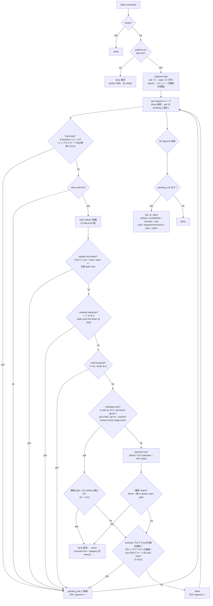

# sensitive-files-guardrail — 保守者ガイド (MAINTAINING.md)

本ファイルは **保守者向け** の実務ガイド (テスト / validate / リリース手順 /
CLI 再実測 Runbook / ログ規則)。利用者向けの概要は [README.md](../README.md)、
設計根拠と実測ログは [DESIGN.md](./DESIGN.md)、判定結果の完全
マトリクスは [MATRIX.md](./MATRIX.md)、パターン設定は
[PATTERNS.md](./PATTERNS.md)、リリースノートは
[CHANGELOG.md](../CHANGELOG.md) を参照。

個人環境に依存するメモ (実機のパス・私的な進捗) は gitignore 済みの
`CLAUDE.local.md` に置き、本ファイルと公開 docs には書かない (例示は
`/path/to/project` のようなダミーを使う)。

> ファイル名を `CLAUDE.md` にしていないのは、plugin root の `CLAUDE.md` は plugin
> として配布されても project context にロードされず、Claude Code CLI 2.1.240 の
> `claude plugin validate` が warning を出すため (保守者ガイドは配布物の一部として
> `docs/` に置く)。

## 目的と非目的 (要点)

- **目的 (思想 1)**: Vibe Coding 中の *うっかり* 露出予防。「API が失敗する →
  `.env` を cat / Read して確認しよう」のような軽い気持ちの閲覧で実値が LLM
  コンテキストに載るのを止める
- **目的 (思想 2)**: block するときは意図を汲んだメッセージ (鍵名・型・値の
  品質状態・代替コマンド) を返し、次の作業に繋げる
- **非目的**: 敵対的バイパス対策 / MCP 経路 / TOCTOU の完全排除 / Windows。
  静的解析が届かない Bash は `ask_or_allow` に倒し、autonomous モード
  (auto / bypassPermissions / plan) では Claude Code ハーネス側の監視に委ねる
  (defense-in-depth の一層)。「判断困難だから deny 強制」の特例は作らない

根拠は DESIGN.md の「設計原則」「ハーネス委譲方針 (defense-in-depth の一層)」。

## ディレクトリ構成

```
sensitive-files-guardrail/
├── .claude-plugin/plugin.json       # version はここにのみ書く (marketplace.json 側には書かない)
├── README.md                        # 利用者向け概要
├── CHANGELOG.md                     # 全バージョンのリリースノート
├── docs/
│   ├── DESIGN.md                    # 設計原則 / Phase 0 実測 / ハーネス委譲方針 / 既知制限
│   ├── MAINTAINING.md               # 本ファイル (保守者向け)
│   ├── MATRIX.md                    # 判定結果の完全マトリクス (5 mode 列)
│   ├── PATTERNS.md                  # patterns.txt / patterns.local.txt の仕様と設定例
│   └── REVIEW_TASKS_*.md            # 完了済みレビューサイクルの作業ログ (D1 で plugin 外へ退避予定)
└── hooks/
    ├── hooks.json                   # PreToolUse(Read/Bash/Edit/Write, timeout 2s) + Stop (timeout 15s)
    ├── _shared/                     # 両 hook 共有ロジック (判定が剥離しないよう一元化)
    │   ├── matcher.py               is_sensitive (case-insensitive + last-match-wins)
    │   └── patterns.py              load_patterns / _parse_patterns_text / [project:] セクション / 除外レシピ
    ├── check-sensitive-files/       # Stop hook
    │   ├── __main__.py
    │   ├── checker.py               git ls-files (tracked / untracked、--recurse-submodules)
    │   ├── stop_ack.py              session 単位の once-only state (0.19.0)
    │   ├── patterns.txt             # 両 hook で共有する既定パターン
    │   └── tests/
    └── redact-sensitive-reads/      # PreToolUse hook
        ├── __main__.py              # --tool read|bash|edit|write の dispatch + fail-closed wrapper
        ├── core/
        │   ├── logging.py           秘密非混入ログ (~/.claude/logs/redact-hook.log)
        │   ├── messages.py          reason 文面 builder (語彙ルール / 除外 hint / category 別 template)
        │   ├── output.py            deny / ask / allow JSON、ask_or_deny / ask_or_allow、LENIENT_MODES
        │   ├── patterns.py          _shared.patterns の薄い wrapper (Read 側の warn callback)
        │   └── safepath.py          normalize / classify / O_NOFOLLOW open
        ├── redaction/               minimal info の生成 (dotenv / json / toml / yaml / keyonly / opaque / file_render)
        ├── handlers/
        │   ├── read_handler.py      Read (fd ベース)
        │   ├── edit_handler.py      Edit / Write (deny 固定 + dotenv キー名ガイド)
        │   ├── bash_handler.py      Bash orchestration + plugin ステート依存 + test seam
        │   └── bash/                pure helper / compile-time 定数 (副作用なし・plugin ステート非依存)
        │       ├── constants.py     allow-list / hard-stop / opaque wrapper / shell keyword
        │       ├── segmentation.py  quote-aware segment 分割 / hard-stop 検出 (0.18.0 で lexer を統一)
        │       ├── interpreters.py  awk / sed プログラム内の動的構文・別インタプリタ委譲の検出 (0.18.0)
        │       ├── operand_lexer.py glob 判定 / path 候補抽出
        │       ├── redirects.py     安全リダイレクト剥離 / 残留 metachar / 書込み target 抽出
        │       └── grep_extract.py  grep family の env-var 名抽出
        └── tests/                   unittest + fixtures/envelopes/
```

テストは `handlers.bash_handler.X` を patch seam として import するため、pure
helper を `handlers/bash/` の別モジュールへ移すときは `bash_handler.py` 側で
再 export を維持する。

## Bash handler 判定フロー (0.19.0)



図で省略している分岐:

- rules が空 (patterns.txt が空) → allow
- operand scan で glob が dotenv stem (`.env` / `.envrc`) に一致しない
  (`cat *.json` 等) → `ask_or_allow` (pending に畳む)。normalize 失敗も同じ
- metadata-only のうち `find` は `-exec` / `-delete` 等を含まない形のみ、
  `file` / `wc` / `du` / `tree` は `-f` / `--files0-from` 等のリスト読込
  option が無い形のみ、`git ls-files` は `-s` / `--stage` / `--format` 無しの形
  のみ、`git rm` は `--cached` 付きで未知 option の無い形のみ (fail-closed)

各経路のコマンド例と mode 別の結果は [MATRIX.md](./MATRIX.md)、
経路の設計根拠は [DESIGN.md](./DESIGN.md) の「Bash handler 判定フロー」
「ハーネス委譲方針」を参照。

## ログ規則

`core/logging.py` の `log_info` / `log_error` の detail には **path / 値 /
basename / command 文字列を絶対に渡さない**。渡してよいのは固定 slug
(エラー種別・classify 結果・判定分類) のみ。0.4.3 から detail は文字種
ホワイトリスト (`^[A-Za-z0-9_:.\-\[\]!]{0,64}$`) で sanitize され違反は `_BAD`
に置換されるが、これは最終防御であって免罪符ではない。

| NG | OK |
|---|---|
| ファイル内容 / 値 | エラー種別 (`FileNotFoundError` 等) |
| 展開後の絶対パス / basename | `classify()` 結果 (regular / symlink / special) |
| Bash command 文字列 | `bash_classify` の固定 slug (`match:<first_token>` 等) |

- ログ先は `~/.claude/logs/redact-hook.log` (plugin cache が消えても残るよう
  `$HOME` 側に固定)。Stop hook はファイルログを持たず stderr のみ
- Stop hook の once-only state (`~/.claude/sensitive-files-guardrail/stop-ack/`)
  も平文 path を持たず sha256 digest のみ (0.19.0)
- `permissionDecisionReason` も同じ原則: 値は出さず、鍵名・型・status・長さ・
  basename までに留める (`docs/DESIGN.md` の設計原則 2)
- 既知課題: unittest が実ログに書き込み計測値を汚染する (bd_092a232e-snw.6)

## テスト実行

plugin root (`plugins/sensitive-files-guardrail`) から実行する。**`cd` は必ず
サブシェル `( ... )` に閉じ込める** — 裸の `cd` を続けて貼ると 1 つ目の後に
シェルが `hooks/redact-sensitive-reads` に残り、2 つ目が
`hooks/redact-sensitive-reads/hooks/check-sensitive-files` に解決されて
"No such file or directory" になる (= 79 件の suite が黙って走らない)。

```bash
# redact-sensitive-reads (0.19.1 時点 827 件)
(cd hooks/redact-sensitive-reads && python3 -m unittest discover tests)

# check-sensitive-files (0.19.1 時点 79 件、tmpdir に git repo を作って検査)
(cd hooks/check-sensitive-files && python3 -m unittest discover tests)
```

両 suite を一括で回すなら (現状 `tests/` は上記 2 つだけ)。失敗を握り潰す経路が
2 つあるので注意する — `for` ループの終了ステータスは**最後の suite のもの**に
なり、締めの `[ … ] && echo … || echo …` の終了ステータスは**`echo` の成功**に
なる。集計した `fail` で明示的に exit し、ブロック全体の終了ステータスに失敗を
伝播させること:

```bash
(
  fail=0
  for d in $(find hooks -type d -name tests); do
    (cd "$(dirname "$d")" && python3 -m unittest discover tests) || fail=1
  done
  [ "$fail" -eq 0 ] && echo "ALL GREEN" || echo "SOME SUITE FAILED"
  exit "$fail"
)
```

全体を `( … )` で囲むのは、**対話シェルに逐語コピーしても `exit` がサブシェルで
止まりシェルごと落ちない**一方、スクリプトに埋め込めばサブシェルの終了ステータスが
そのままブロックの結果になり `set -e` にも乗るため (どちらの使い方でも直後の
`echo $?` で 0 / 非 0 を確認できる)。リリースチェックリストや CI から呼ぶときも
この形のまま使う。

- `tests/_testutil.py` が hook dir と `hooks/` を `sys.path` に挿入するため環境
  変数の設定は不要。ただし `_testutil.py` がするのは `sys.path` の操作**だけ**で、
  `HOME` / `XDG_CONFIG_HOME` の隔離はしない。隔離は必要なテストクラスが個別に
  `mock.patch.dict(os.environ, ...)` で適用している (`test_patterns_loader.py` /
  `test_bash_handler.py` / `test_edit_handler.py` / `test_e2e.py` /
  `test_checker.py` / `test_main.py` / `test_stop_ack.py` ほか)
- 隔離が効く範囲は解決タイミングで決まる。`patterns.local.txt` と stop-ack state
  は `Path.home()` を**関数内**で解決するため env 差し替えが効く
  (`_shared/patterns.py::_resolve_local_patterns_path` /
  `check-sensitive-files/stop_ack.py::resolve_state_dir`)。一方
  `core/logging.py::LOG_PATH` は **import 時**に `Path.home()` で確定するので、
  後から `HOME` を差し替えても向き先は変わらない。tmpdir に逃がしているのは
  `mock.patch.object(L, "LOG_PATH", ...)` を使う `test_logging.py` だけで、
  それ以外のテストは実 `~/.claude/logs/redact-hook.log` に書きうる
  (「ログ規則」節の既知課題と同じ根。新しいテストでログ書込を伴う経路を叩くなら
  `LOG_PATH` 自体を patch すること)
- marketplace の CI (`.github/workflows/validate.yml`) も同じ
  `python3 -m unittest discover tests` を、同じくサブシェルで `cd` する形で
  `plugins/*/hooks/*/tests` の親を列挙して実行する (CI 側は失敗したスイートを
  集計して job を fail させる)。Python は 3.12 に固定。要件は **3.11+** で、
  3.11 未満では `tomllib` 不在で TOML 系テストが fail する
- テストを追加するときは既存の書式 (mode 5 列の envelope fixture、`_make_envelope`
  / `_decision` ヘルパ) に合わせ、判定境界を変える変更は MATRIX.md の行と対にする

## validate

```bash
claude plugin validate .                                   # plugin root で
claude plugin validate plugins/sensitive-files-guardrail   # marketplace root で
```

warning 0 であること (`description` / `author` / `version` は plugin.json に
揃っている)。

## 手動スモーク

```bash
mkdir -p /tmp/guardrail-smoke && cd /tmp/guardrail-smoke && git init -q
printf 'DATABASE_URL=postgresql://u:p@h/d\nJWT_SECRET=changeme\n' > .env
claude --plugin-dir /path/to/plugins/sensitive-files-guardrail
```

対話セッションで `.env を見せて` (Read deny + minimal info) / `cat .env`
(Bash deny + category 別 reason) / `.env に KEY=1 を追記して` (Edit/Write deny +
キー名ガイド) を試し、応答終了時に Stop hook の block (tracked / untracked の
列挙 + 除外レシピ) が出ることを確認する。

headless (`claude -p`) で hook の発火を検証するときは `--permission-mode auto` と
stdin `< /dev/null` を付ける (`acceptEdits` は subagent 承認待ちでハングし、
`bypassPermissions` は呼び出し側で拒否される)。

## CLI バージョンアップ時の再実測手順 (Runbook)

`core/output.py::LENIENT_MODES` と `tests/fixtures/envelopes/README.md` の
列挙は Claude Code CLI の `permission_mode` 値に依存する。

**発火条件: CLI を upgrade したら毎回 (major / minor / patch を問わない)。**
加えて、リリースノートが permission mode に言及したときは version 差の大小に
関わらず実施する。major 限定にしてはいけない理由は、**同一バージョンライン内の
patch で mode が増えた実例がある**ため — `auto` は **CLI 2.1.83** で追加された
(「依存関係」節に記録がある)。major 契機だけにすると、この種の追加を次の major
まで無期限に取りこぼす。

**この Runbook が唯一の検出手段である。**
`tests/test_envelope_shapes.py::TestLenientModesSubset` は repo 内の静的な定数
どうしの包含関係しか見ず、実際に捕捉した envelope を参照しない。CLI が新しい
`permission_mode` を返し始めても suite は green のままなので、**テストが green で
あることは「CLI 側が変わっていないこと」の証拠にならない** (step 5 参照)。

以下を走らせて乖離が無いか確認する。

### 1. CLI が受け付ける permission mode を列挙する

**この step を先頭に置くのが要点。** probe 対象を既知 6 値の固定列挙にすると、
CLI が追加した mode は一度も選択されず、採取した envelope にも現れないため、
step 5 の突合が**原理的に**新 mode を検出できない (手順が循環する)。
probe 対象は**その CLI 自身に聞いて**決める。

```bash
claude --version
claude --help | grep -A5 -- "--permission-mode"
```

`--permission-mode` の `choices:` に並ぶ値が、その CLI が**起動時に受け付ける**
mode の全量。以降の step ではこの列挙結果を probe 対象にする
(このガイドに書かれた固定列挙をコピーしないこと — 書いた時点の値でしかない)。

補助手段として、リリースノート / 公式 docs の permission mode 節も確認する。
`--help` の choices と envelope に出る値は**一致しない**点に注意 — 例えば
`default` は「`--permission-mode` を指定しなかったとき」の値なので choices には
現れないが、envelope の `permission_mode` には出る。したがって choices は
「起動で選べる集合」であって「envelope に出うる集合」の全量ではない。

### 2. envelope 採取用の一時 probe スクリプトを作成

`hooks/_debug/capture_envelope.py` として配置する (実測後に削除する。
`hooks/_debug/` は commit しない):

```python
#!/usr/bin/env python3
"""stdin JSON を /tmp/envelope-<tool>-<ts>.json に保存し no-op allow を返す。"""
import argparse, json, sys, time
from pathlib import Path

p = argparse.ArgumentParser()
p.add_argument("--tool", required=True)
args = p.parse_args()
raw = sys.stdin.read()
ts = time.strftime("%Y%m%dT%H%M%S")
out = Path("/tmp") / f"envelope-{args.tool}-{ts}.json"
try:
    envelope = json.loads(raw) if raw.strip() else {}
except Exception as e:
    envelope = {"_probe_parse_error": str(e), "_raw": raw}
with out.open("w") as f:
    json.dump(envelope, f, indent=2, ensure_ascii=False)
sys.stdout.write("{}")
```

### 3. hooks.json の matcher を差し替え

本番 hook を壊さないよう別コピーで作業するか、git で戻せる状態にしてから
`Bash` matcher の command を probe に向ける:

```json
{
  "matcher": "Bash",
  "hooks": [
    {
      "type": "command",
      "command": "python3 ${CLAUDE_PLUGIN_ROOT}/hooks/_debug/capture_envelope.py --tool bash",
      "timeout": 2
    }
  ]
}
```

### 4. step 1 で列挙した mode を 1 つ残らず probe する

`claude --plugin-dir .` で起動し、**step 1 の `choices:` に出た値すべて**について
`--permission-mode <mode>` で起動 (またはセッション内で切替) して `date` を 1 回ずつ
実行する。**加えて `--permission-mode` を付けない既定起動でも 1 回**実行する
(choices に現れない `default` を踏むため)。

ここで回すのは step 1 の列挙であって、このガイドや `_KNOWN_PERMISSION_MODES` の
固定列挙ではない。**既知列挙を起点にすると新 mode が probe されず、step 5 で
検出できない**（これが R3 で指摘された循環そのもの）。

採取した envelope から実測値の集合を作る:

```bash
grep -h '"permission_mode"' /tmp/envelope-bash-*.json | sort -u
```

この集合 (= 実際に envelope へ出た値) と step 1 の choices の両方が、step 5 の
突合対象になる。

### 5. `_KNOWN_PERMISSION_MODES` と**双方向**に突合する

**テストは CLI の新 mode を自動検出しない。突合は人手で行う。**
`tests/test_envelope_shapes.py::TestLenientModesSubset` が検査しているのは
`LENIENT_MODES - _KNOWN_PERMISSION_MODES` が空か、という**リポジトリ内の静的な
定数どうしの包含関係**だけで、採取した envelope は一切参照しない。CLI が新しい
`permission_mode` を返し始めても suite は green のままで、シグナルにはならない。

step 1 の CLI 列挙と step 4 の envelope 実測値を、`tests/test_envelope_shapes.py`
の `_KNOWN_PERMISSION_MODES` と**両方向**で突き合わせる。差分の向きで意味と対応が
異なるので、片方向だけ見て終わらせないこと:

| 差分の向き | 意味 | 対応 |
|---|---|---|
| CLI 列挙 / 実測値に**あって**定数に**無い** | mode が**追加**された | 下の更新手順を実施 |
| 定数に**あって** CLI 列挙に**無い** | launch choice ではないだけかもしれない (`default` が該当) | **単純削除しない**。step 4 の envelope 実測値に出るなら定数は維持が正しい。実測値にも出ないことを確認できて初めて削除を検討する |

「追加」側を確認したときの更新手順:

1. 実測で確認した新 mode を `_KNOWN_PERMISSION_MODES` に追加
2. `TestLenientModesSubset::test_known_modes_contains_six_canonical_entries` の
   期待件数を新しい件数に更新する (テスト名にも件数が入っているので rename も)。
   この assert が red になるのは**上の 1. で列挙を増やした後**であって、CLI 変化の
   検知ではない。列挙を増やしたのに関連 docs を直し忘れる事故を止めるための
   「更新漏れ検知」と理解する
3. autonomous として扱ってよいなら `LENIENT_MODES` にも追加 (Bash の静的解析
   不能ケースで allow に倒したいかを判断)。**これは判定境界の変更**にあたるので、
   envelope 実値で挙動を確認してから決める
4. `tests/fixtures/envelopes/README.md` の列挙を更新
5. `docs/DESIGN.md` (LENIENT_MODES 方針) と `docs/MATRIX.md` の mode 列を更新
6. 下の実測ログに実測日と CLI version を追記

### 6. debug 差し戻し

`hooks.json` を元に戻し、`hooks/_debug/` を削除する。

### Worked example: `manual` の取りこぼし (CLI 2.1.241, 2026-08-24 実測)

この手順が何を捕まえるのかの実例。**旧手順 (既知 6 値を固定 probe) では発見でき
なかったドリフトが、step 1 を足しただけで即座に露見した。**

step 1 を実行した結果:

```
$ claude --version
2.1.241 (Claude Code)

$ claude --help | grep -A3 permission-mode
  --permission-mode <mode>   Permission mode to use for the session
                             (choices: "acceptEdits", "auto",
                              "bypassPermissions", "manual",
                              "dontAsk", "plan")
```

step 5 の双方向突合にかけると:

| 差分の向き | 値 | 判定 |
|---|---|---|
| CLI 列挙にあって定数に無い | **`manual`** | **追加**。`_KNOWN_PERMISSION_MODES` が stale |
| 定数にあって CLI 列挙に無い | `default` | 上表の下段どおり **削除しない**。`--permission-mode` で選べないだけで envelope には出る値 |

旧手順は「`default` / `auto` / `plan` / `acceptEdits` / `dontAsk` /
`bypassPermissions` のそれぞれで `date` を実行する」と固定列挙していたため、
`manual` を一度も選択せず、採取した envelope にも現れず、突合の分岐にも到達しな
かった。**「唯一の検出手段」を名乗りながら実際には検出できていなかった**という
のが R3 指摘の中身で、これがその実物。

**現状 (0.19.1 時点): `manual` は未追随。** 本リリースは docs 整合のみのため
`_KNOWN_PERMISSION_MODES` / `LENIENT_MODES` は変更していない。`manual` の登録と
lenient 収録の可否は、envelope 実値を probe しないと確定できず (収録は判定境界の
変更にあたる)、別チケット **`bd_092a232e-snw.28`** で対応する。

### Phase 0 実測ログ

| 日付 | CLI version | 実測内容 | 結果 |
|---|---|---|---|
| 2026-04-11 | 2.1.101 | `permissionDecisionReason` / `systemMessage` / `ask` reason の配信経路 | deny 時の reason はモデルに完全配信、`systemMessage` はモデルに届かない、`ask` reason はユーザー UI のみ。要点は `docs/DESIGN.md` の Phase 0 節 |
| 2026-04-22 | 2.1.101 系 | plan mode での Bash hook 発火有無 | **非発火** (Case C)。`LENIENT_MODES` の `"plan"` は dead entry と判断し 0.6.0 で撤去 |
| 2026-05-18 | 2.1.x (envelope 未採取) | plan mode での Bash hook 発火有無 (実機の体感) | **発火** を確認 (調査ワンライナーが ask に倒れた)。0.13.0 で `"plan"` を再追加。専用 envelope での再実測は未実施 |
| 2026-08-24 | 2.1.241 | step 1 (`claude --help` の `--permission-mode` choices 列挙) のみ実施 | choices は `acceptEdits` / `auto` / `bypassPermissions` / **`manual`** / `dontAsk` / `plan`。**`manual` が `_KNOWN_PERMISSION_MODES` に無い**ことを検出 (上の Worked example)。`default` は choices に無いが envelope 側に出るため維持。envelope 採取 (step 2〜4) と定数更新は未実施 — `bd_092a232e-snw.28` |

## 拡張ポイント

- **Bash handler の認識コマンド**: `handlers/bash/constants.py` の
  `_SAFE_READ_FIRST_TOKENS` (residual metachar の ask を skip) /
  `_METADATA_ONLY_FIRST_TOKENS` + `_GIT_METADATA_SUBCOMMANDS` (operand scan を
  skip して allow) / `_OPAQUE_WRAPPERS` / `_HARD_STOP_CHARS`。クォート内
  hard-stop を無視してよい inert コマンドは `handlers/bash/interpreters.py` の
  `_QUOTE_RELAX_FIRST_TOKENS` / `_GIT_INERT_SUBCOMMANDS`。allow 側に足すときは
  「operand の内容を stdout に出す option が無いか」(option-leak) を必ず確認し、
  `docs/MATRIX.md` の行と mode 5 列のテストを同時に足す
- **deny 文面**: `core/messages.py` (category 別 template と語彙ルール)。handler
  から文字列を直接組み立てない
- **パターン追加**: `patterns.txt` / `redaction/engine.py::_detect_format` /
  `tests/test_matcher.py::DEFAULT_RULES` の 3 点同期 ([PATTERNS.md](./PATTERNS.md))
- **新 format**: `_detect_format` の分岐を増やし `redaction/<format>.py` を追加
- **Edit/Write**: `handlers/edit_handler.py` (`file_path` 前提の共通 dispatch。
  NotebookEdit は `edits` 形状が違うため未対応)
- **Stop**: `check-sensitive-files/checker.py` (git 呼出) / `stop_ack.py`
  (once-only state)

## リリース手順

1. `.claude-plugin/plugin.json` の `version` を semver で bump (挙動変更・機能
   追加 = minor、修正・docs のみ = patch)。marketplace.json 側には書かない。
   version は pin として働くため bump を忘れると既存ユーザーに配布されない
2. `CHANGELOG.md` に今回のリリース節を追加。見出しは step 1 で bump した version と
   同じ `## X.Y.Z` にし、`## Unreleased` の**直下**に置く (`## Unreleased` の
   中身として書かない)。**判定境界 (deny / allow / ask) の変化有無** と
   **両 suite の件数** を必ず書く
3. **CHANGELOG の cut (`## Unreleased` との突合)。** この step を飛ばすと出荷済みの
   内容が `## Unreleased` に残ったまま公開され、0.19.1 が直した snw.7 (出荷済みの
   E5 が「Unreleased (PR 6)」表記のまま残っていた) と同じ状態を再生産する:
   - **`## Unreleased` 節を読み直し、今回出荷した項目をすべて step 2 の
     `## X.Y.Z` 節へ移す。** `## Unreleased` に残してよいのは「このリリースでは
     出荷していない」項目だけ。snw.7 は roadmap 項目が実装されたのに移されなかった
     ことで起きたので、**この突合が再発防止の本体**。機械判定できないので目視で行う
   - 移し終えたら、`## Unreleased` に残った各項目について「今回の実装・テスト・
     `## X.Y.Z` 節のいずれにも現れない」ことを確認する
   - 機械チェック (cut 忘れの検出):

     ```bash
     v=$(python3 -c 'import json;print(json.load(open(".claude-plugin/plugin.json"))["version"])')
     grep -q "^## ${v}\$" CHANGELOG.md && echo "OK: ## ${v} あり" || echo "NG: cut 忘れ"
     ```

     これが捕まえるのは「bump したのに節を作っていない」場合**だけ**で、上の突合
     (出荷済み項目が `## Unreleased` に残っている) は**検出しない**。snw.7 のときも
     `## 0.14.0` 節自体は存在していた
4. docs 整合チェック (0.19.1 で追加):
   - `grep -rn Unreleased README.md docs/ hooks/ --exclude='REVIEW_TASKS_*.md'` が
     本節の記述以外にヒットしないこと (README / docs / hooks が機能を「Unreleased」と
     書いていないことの確認。出荷済みなら実バージョン表記に直す。CHANGELOG 側の
     `## Unreleased` は step 3 で扱う。REVIEW_TASKS は日付付きの作業ログなので
     当時の表記を残す)
     - **この grep は `CHANGELOG.md` を対象に含めない。** CHANGELOG には次サイクル用の
       `## Unreleased` が常設されるため、含めると恒久的にヒットして決して満たせない
       条件になる。対象外なので **step 3 の cut の前後どちらで実行しても期待値は同じ**
       (= 本節の記述以外ヒットなし)
   - `grep -rn '/Users/' README.md docs/` が本節の記述以外にヒットしないこと
     (個人パス混入の検知。例示は `/path/to/project` 等のダミー)
   - 見出しを変えたら参照元 (`grep -rn '#' README.md docs/` で該当アンカー) を
     同時に更新する
5. 両 suite green + `claude plugin validate .` warning 0。スクリプトに組み込むときは
   「テスト実行」節の一括実行ブロックをそのまま使い、**`echo $?` が 0 であること**を
   条件にする (`ALL GREEN` / `SOME SUITE FAILED` のサマリ文字列の目視や、終了
   ステータスを見ない `&&` チェーンだけに頼らない)
6. commit (`feat|fix|docs(sensitive-files-guardrail): … (vX.Y.Z)`) → push →
   PR → Codex review → merge。tag は必要に応じて付ける

## Step 0-c 実測結果 (将来更新予定)

Step 0-c (outer timeout 発火時の Claude Code 挙動実測) は未実施。暫定方針として
Case A (timeout kill → allow / fail-open の最悪ケース想定) で Windows (SIGALRM
非対応) を hook 冒頭で deny exit にしている (`__main__._is_unsupported_platform`)。

実測後、以下のいずれかに方針確定:

- **Case A 確定**: Windows 非対応を README の既知制限に明記継続
- **Case B 確定**: timeout kill → deny で Claude Code が継続するなら、Windows
  でも hang = 自動 deny となり安全。`_is_unsupported_platform` ガードを解除可能

実測手順:

1. `hooks.json` の `timeout: 2` の hook に `time.sleep(5)` を仕込む
2. `claude --plugin-dir .` で起動して Read を実行
3. timeout kill 後、Claude Code が allow / ask / deny のどれを返すか観察
4. 結果を [DESIGN.md](./DESIGN.md) と本節に追記

## 依存関係

- **Python 3.11+** (標準ライブラリのみ、`pip install` 不要。`tomllib` は 3.11+
  標準で、未満では TOML の構造付き minimal info が opaque に劣化する)
- **Git 1.7+** (`git ls-files --recurse-submodules`)
- **Claude Code CLI 2.1.100+** (`permission_mode: auto` は 2.1.83+ で追加)
- macOS / Linux。Windows は上記 Step 0-c の確定まで fail-closed で deny
